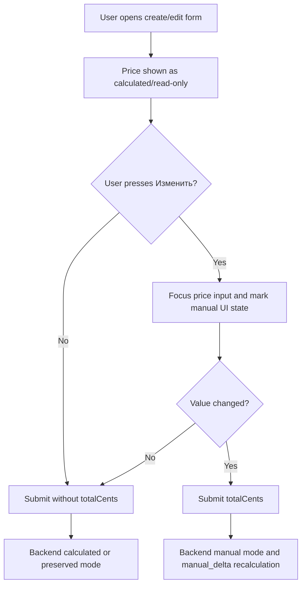

# Appointment Manual Total PATCH and Mobile Implementation Plan

This plan makes appointment pricing safe and consistent across backend, web, and React Native by using explicit manual-price activation, partial PATCH updates, and the existing `base(line_items) + manual_delta_cents` domain model.

> **For agentic workers:** REQUIRED SUB-SKILL: Use superpowers:subagent-driven-development (recommended) or superpowers:executing-plans to implement this plan task-by-task. Steps use checkbox (`- [ ]`) syntax for tracking.

**Goal:** Manual appointment total editing should work for create and edit flows in web and mobile without accidentally converting calculated prices to manual prices.

**Architecture:** Keep the DB model unchanged: `appointment_line_items` define the calculated base, while `appointments.total_cents`, `total_source`, and `manual_delta_cents` store the persisted total mode. Add partial PATCH support for appointment edit endpoints, share pure price-state helpers in web/mobile where practical, and introduce small local UI controls instead of depending on a non-existent `InputButtonGroup` package.

**Tech Stack:** Go 1.24 `net/http` + service layer + GORM/PostgreSQL, React + TypeScript + MUI + RTK Query, React Native + Expo + TanStack Query.

---

## Product Rules

- **Default total mode:** price is calculated from selected services unless the user explicitly presses `Изменить` and changes the price.
- **Create with no manual price:** frontend/mobile omit `totalCents`; backend stores `total_source = calculated` and `manual_delta_cents = 0`.
- **Create with manual price:** frontend/mobile send `totalCents`; backend stores `total_source = manual` and `manual_delta_cents = totalCents - baseTotal`.
- **Edit with no price change:** clients omit `totalCents`; backend must not switch the record to manual just because the field was displayed.
- **Edit services in calculated mode:** backend recalculates total from selected services.
- **Edit services in manual mode:** backend preserves `manual_delta_cents` and recalculates `total_cents = max(0, baseTotal + manual_delta_cents)`.
- **Edit manual price:** clients send `totalCents`; backend recalculates `manual_delta_cents` from current/new base.
- **Reset to calculated:** if implemented in UI, use explicit `resetTotalToCalculated: true`; do not overload `totalCents: null` unless backend gets a presence-aware JSON type.
- **Priority:** master personal appointments first, then salon dashboard appointments, then mobile parity.



---

## File Structure

### Backend

- Modify: `backend/internal/controller/dashboard_appointment_handlers.go`
  - Accept `PATCH /api/v1/dashboard/appointments/:id` in addition to existing `PUT`.
  - Reuse the existing parsing logic for partial update body.
- Modify: `backend/internal/controller/master_dashboard_controller.go`
  - Accept `PATCH /api/v1/master-dashboard/appointments/:id` in addition to existing `PUT`.
  - Keep `PUT` as backwards-compatible alias during rollout.
- Modify: `backend/internal/service/master_dashboard.go`
  - Add `totalSource` to `MasterAppointmentDTO` list responses so web edit forms can restore the persisted calculated/manual mode.
- Modify: `backend/internal/service/dashboard_types.go`
  - Add `ResetTotalToCalculated bool` only if reset UX is implemented.
- Modify: `backend/internal/service/dashboard_appointment.go`
  - Wire explicit reset if supported.
- Test: `backend/internal/service/appointment_total_test.go`
  - Extend existing total-state tests.
- Test candidate: controller tests if this repo already has nearby HTTP handler tests; otherwise service tests are the minimum.

### Web Frontend

- Create: `frontend/src/shared/ui/PriceEditControl/PriceEditControl.tsx`
  - Local replacement for the unavailable `InputButtonGroup` package.
  - MUI-based composed control: read-only numeric display + `Изменить` button + focus on edit.
- Create: `frontend/src/shared/ui/PriceEditControl/index.ts`
- Create/extend: `frontend/src/shared/lib/appointmentPriceForm.ts`
  - Pure helpers for selected services total, manual activation, reset, payload decisions.
- Modify: `frontend/src/pages/master-dashboard/ui/drawers/CreateMasterAppointmentDrawer.tsx`
  - Add manual total override for personal appointment creation.
- Modify: `frontend/src/pages/master-dashboard/ui/drawers/MasterPersonalAppointmentDrawer.tsx`
  - First-priority edit flow: read-only total by default, explicit manual editing, PATCH diff payload.
- Modify: `frontend/src/entities/master/model/masterDashboardApi.ts`
  - Add `totalSource?: 'calculated' | 'manual'` to `MasterAppointmentDTO`.
  - Add `totalCents?: number` to create body.
  - Change update mutation method from `PUT` to `PATCH`.
- Modify: `frontend/src/pages/dashboard/ui/drawers/CreateAppointmentDrawer.tsx`
  - Replace always-editable total with the same explicit manual mechanism.
- Modify: `frontend/src/pages/dashboard/ui/drawers/AppointmentDrawer.tsx`
  - Replace always-editable total with explicit manual edit and PATCH diff payload.
- Modify: `frontend/src/entities/appointment/model/appointmentApi.ts`
  - Change update mutation method from `PUT` to `PATCH`.

### React Native Mobile

- Create: `mobile/src/features/appointments/PriceEditField.tsx`
  - RN counterpart of `PriceEditControl`: display row + `Изменить` button + focused `TextInput` when active.
- Create/extend: `mobile/src/features/appointments/priceForm.ts`
  - RN-safe helper functions: parse rubles, format rubles, calculate selected total, decide whether to send `totalCents`.
- Modify: `mobile/app/appointments/new.tsx`
  - Add manual total override to create personal appointment.
- Modify: `mobile/src/features/appointments/AppointmentEditTab.tsx`
  - Stop always sending `totalCents`; switch edit request from `PUT` to `PATCH`; include `totalCents` only after explicit manual edit and value change.
- Modify: `mobile/src/entities/appointments/api.ts`
  - Keep `CreatePersonalAppointmentInput.totalCents?: number`; add/update update input helper if extraction is useful.
- Modify: `mobile/src/features/appointments/AppointmentDetailsTab.tsx`
  - No edit logic change required; keep price display and status patch behavior.

### Docs

- Modify: `docs/vault/product/status.md`
  - Add shipped note after implementation, not during planning.

---

## Task 1: Backend PATCH Contract

**Files:**

- Modify: `backend/internal/controller/dashboard_appointment_handlers.go`
- Modify: `backend/internal/controller/master_dashboard_controller.go`

- [ ] **Step 1: Add dashboard PATCH routing**

In `backend/internal/controller/dashboard_appointment_handlers.go`, edit the existing branch around line 45. Replace:

```go
if r.Method == http.MethodPut {
	h.putAppointment(w, r, salonID, id)
	return
}
```

with:

```go
if r.Method == http.MethodPut || r.Method == http.MethodPatch {
	h.putAppointment(w, r, salonID, id)
	return
}
```

- [ ] **Step 2: Add master PATCH routing**

In `backend/internal/controller/master_dashboard_controller.go`, edit the existing branch around line 374. Replace:

```go
if len(parts) == 2 && r.Method == http.MethodPut {
```

with:

```go
if len(parts) == 2 && (r.Method == http.MethodPut || r.Method == http.MethodPatch) {
```

Do not duplicate the handler body; keep the existing parse/update code unchanged.

- [ ] **Step 3: Add master appointment total source to DTO**

In `backend/internal/service/master_dashboard.go`, extend `MasterAppointmentDTO`:

```go
TotalSource string `json:"totalSource"`
```

and populate it in `ListAppointments`:

```go
TotalSource: a.TotalSource,
```

This is required because `MasterPersonalAppointmentDrawer` must know whether an existing appointment is already `manual`.

- [ ] **Step 4: Verify existing service behavior**

Confirm these invariants in `dashboard_appointment.go` and `master_dashboard.go`:

```go
// totalCents omitted -> ExplicitManualTotal nil
// serviceIds omitted -> len(in.ServiceIDs) == 0 -> servicesUpdated false
nextTotalState := applyTotalUpdate(currentTotalState, nextBaseTotal, appointmentTotalUpdate{
	ServicesUpdated:          servicesUpdated,
	ExplicitManualTotal:      in.TotalCents,
	ResetToCalculatedIfEmpty: true,
})
```

- [ ] **Step 5: Run backend tests**

Run:

```bash
go test ./...
```

from `backend/`.

Expected: PASS. If unrelated failures exist, record exact failing package/test.

---

## Task 2: Backend Total-State Tests

**Files:**

- Modify: `backend/internal/service/appointment_total_test.go`

- [ ] **Step 1: Add test for no accidental manual update**

Add:

```go
func TestApplyTotalUpdate_NoExplicitTotalKeepsCalculatedWhenServicesUnchanged(t *testing.T) {
	current := computeTotalState(3500, "calculated", nil, nil)
	next := applyTotalUpdate(current, 3500, appointmentTotalUpdate{})
	if next.TotalCents != 3500 || next.TotalSource != "calculated" || next.ManualDeltaCents != 0 {
		t.Fatalf("unexpected unchanged calculated result: %+v", next)
	}
}
```

- [ ] **Step 2: Add test for explicit manual total on create/edit**

Add:

```go
func TestApplyTotalUpdate_ExplicitManualTotalStoresDelta(t *testing.T) {
	current := computeTotalState(5000, "calculated", nil, nil)
	manual := int64(4200)
	next := applyTotalUpdate(current, 5000, appointmentTotalUpdate{ExplicitManualTotal: &manual})
	if next.TotalCents != 4200 || next.TotalSource != "manual" || next.ManualDeltaCents != -800 {
		t.Fatalf("unexpected manual result: %+v", next)
	}
}
```

- [ ] **Step 3: Run focused backend test**

Run:

```bash
go test ./internal/service -run 'TestApplyTotalUpdate' -count=1
```

Expected: PASS.

---

## Task 3: Shared Web Price Control and Helpers

**Files:**

- Create: `frontend/src/shared/ui/PriceEditControl/PriceEditControl.tsx`
- Create: `frontend/src/shared/ui/PriceEditControl/index.ts`
- Create/extend: `frontend/src/shared/lib/appointmentPriceForm.ts`

- [ ] **Step 1: Implement helper API**

Create helpers with this public API:

```ts
export type AppointmentPriceForm = {
  manualEnabled: boolean;
  valueCents: number | null;
  initialValueCents: number | null;
};

export function rubToCents(raw: string): number | null;
export function centsToRubInput(value: number | null): string;
export function calculateSelectedServicesTotalCents<
  T extends { id: string; priceCents?: number | null },
>(serviceIds: string[], services: T[]): number;
export function shouldSendManualTotal(form: AppointmentPriceForm): boolean;
```

Rules:

```ts
shouldSendManualTotal(form) === form.manualEnabled &&
  form.valueCents !== form.initialValueCents &&
  form.valueCents !== null;
```

- [ ] **Step 2: Build local `PriceEditControl` instead of external dependency**

Use MUI primitives only:

```tsx
<TextField inputRef={inputRef} disabled={!editable || !manualEnabled} type="number" />
<Button onClick={() => { setManualEnabled(true); queueMicrotask(() => inputRef.current?.focus()) }}>Изменить</Button>
```

Required props:

```ts
type PriceEditControlProps = {
  label: string;
  valueCents: number | null;
  calculatedCents: number;
  editable: boolean;
  manualEnabled: boolean;
  onManualEnabledChange: (next: boolean) => void;
  onValueCentsChange: (next: number | null) => void;
};
```

- [ ] **Step 3: Visual states**

Style requirements:

- read-only state: neutral border/background, `Изменить` visible;
- editing state: accent border/background tint, focused number input;
- helper text: show `Авторасчёт из услуг: X ₽` when not manual;
- manual state: show `Цена изменена вручную`.

- [ ] **Step 4: Run frontend lint**

Run:

```bash
npm run lint
```

from `frontend/`.

Expected: PASS or only pre-existing unrelated failures.

---

## Task 4: Web Master Personal Create/Edit

**Files:**

- Modify: `frontend/src/entities/master/model/masterDashboardApi.ts`
- Modify: `frontend/src/pages/master-dashboard/ui/drawers/CreateMasterAppointmentDrawer.tsx`
- Modify: `frontend/src/pages/master-dashboard/ui/drawers/MasterPersonalAppointmentDrawer.tsx`

- [ ] **Step 1: Update master API types and method**

Add persisted total mode to `MasterAppointmentDTO`:

```ts
totalSource?: 'calculated' | 'manual'
```

Add `totalCents?: number` to `CreateMasterPersonalAppointmentBody` and change update method:

```ts
method: "PATCH";
```

Keep invalidation:

```ts
invalidatesTags: ["MasterAppointments", "FinanceSummary", "FinanceExpenses"];
```

- [ ] **Step 2: Add manual total to create drawer**

In `CreateMasterAppointmentDrawer`, add state:

```ts
const calculatedTotalCents = useMemo(
  () =>
    services
      .filter((s) => form.serviceIds.includes(s.id))
      .reduce((sum, s) => sum + (s.priceCents ?? 0), 0),
  [form.serviceIds, services],
);
const [manualTotalEnabled, setManualTotalEnabled] = useState(false);
const [manualTotalCents, setManualTotalCents] = useState<number | null>(null);
```

Submit rule:

```ts
...(manualTotalEnabled && manualTotalCents !== null && manualTotalCents !== calculatedTotalCents
  ? { totalCents: manualTotalCents }
  : {}),
```

- [ ] **Step 3: Add explicit total editing to edit drawer**

In `MasterPersonalAppointmentDrawer`, replace the always-editable `TextField` with `PriceEditControl`.

Initial state:

```ts
const initialTotalCents = appointment.totalPriceCents ?? null;
const isInitiallyManual = appointment.totalSource === "manual";
const [manualTotalEnabled, setManualTotalEnabled] = useState(isInitiallyManual);
const [manualTotalCents, setManualTotalCents] = useState<number | null>(
  initialTotalCents,
);
```

If `appointment.totalSource === "manual"`, the drawer must show the persisted manual total (`appointment.totalPriceCents`) instead of switching the visual state back to calculated mode. Still do not send `totalCents` unless the user changes the value.

PATCH body should include only changed fields:

```ts
const body: UpdateMasterPersonalAppointmentBody = {};
if (!arraysEqual(form.serviceIds, initialServiceIds))
  body.serviceIds = form.serviceIds;
if (form.startsAt !== appointment.startsAt) body.startsAt = form.startsAt;
if (form.guestName.trim() !== (appointment.clientLabel ?? "").trim())
  body.guestName = form.guestName.trim();
if (normalizedPhoneChanged) body.guestPhone = parsedPhoneOrNull;
if (form.note.trim() !== (appointment.clientNote ?? "").trim())
  body.clientNote = form.note.trim() || null;
if (
  manualTotalEnabled &&
  form.totalCents !== initialTotalCents &&
  form.totalCents !== null
)
  body.totalCents = form.totalCents;
```

Before calling `updateAppointment`, guard against empty PATCH bodies:

```ts
if (Object.keys(body).length > 0) {
  await updateAppointment({ id: appointment.id, body }).unwrap();
}
```

If the status is changed separately, still run the status PATCH even when this field body is empty.

- [ ] **Step 4: Verify master web flows manually**

Manual smoke:

- create personal appointment without pressing `Изменить` => API body has no `totalCents`;
- create personal appointment with manual total => API body has `totalCents`;
- edit personal appointment time only => PATCH body has no `totalCents`;
- edit personal appointment price => PATCH body has `totalCents`;
- edit services in manual record => visible total preserves delta or manual value per selected UX rule.

---

## Task 5: Web Salon Dashboard Create/Edit

**Files:**

- Modify: `frontend/src/entities/appointment/model/appointmentApi.ts`
- Modify: `frontend/src/pages/dashboard/ui/drawers/CreateAppointmentDrawer.tsx`
- Modify: `frontend/src/pages/dashboard/ui/drawers/AppointmentDrawer.tsx`

- [ ] **Step 1: Change update mutation to PATCH**

In `appointmentApi.ts`, change:

```ts
method: "PATCH";
```

Payload builder already omits `undefined`; preserve that behavior.

- [ ] **Step 2: Use `PriceEditControl` on create**

In `CreateAppointmentDrawer`, keep calculated total from selected salon services and send `totalCents` only when explicit manual edit differs from calculated total.

- [ ] **Step 3: Use `PriceEditControl` on edit**

In `AppointmentDrawer`, replace always-editable total input with explicit manual edit. Build PATCH body by diffing current form against appointment detail. For `serviceIds`, compare against `appointment.services?.map(s => s.id)` first, then legacy `appointment.serviceId`.

- [ ] **Step 4: Guard empty PATCH bodies**

Before calling the dashboard update mutation, skip field PATCH when no fields changed:

```ts
if (Object.keys(body).length > 0) {
  await updateAppointment({ id: appointment.id, body }).unwrap();
}
```

If the status is changed separately, still run the status PATCH even when this field body is empty.

- [ ] **Step 5: Confirm status reset behavior**

If a confirmed appointment changes structural fields, existing backend resets to `pending`. Price-only manual update should be treated as non-structural unless product requires re-confirmation. Keep current behavior unless tests show a mismatch.

---

## Task 6: Mobile Price Helpers and Control

**Files:**

- Create: `mobile/src/features/appointments/priceForm.ts`
- Create: `mobile/src/features/appointments/PriceEditField.tsx`

- [ ] **Step 1: Extract mobile price helpers**

Move/extend `parseRubToTotalCents` from `AppointmentEditTab.tsx` into `priceForm.ts`:

```ts
export function parseRubToTotalCents(raw: string): number | null {
  const normalized = raw
    .trim()
    .replace(/\u00A0/g, " ")
    .replace(/\s+/g, "")
    .replace(",", ".");
  if (normalized === "" || normalized === "." || normalized === "-")
    return null;
  const n = Number(normalized);
  if (!Number.isFinite(n)) return null;
  return Math.max(0, Math.round(n * 100));
}

export function formatCentsToRubInput(cents: number | null): string {
  return cents == null ? "" : String(Math.round(cents / 100));
}

export function selectedServicesTotalCents(
  serviceIds: string[],
  services: Array<{ id: string; priceCents?: number | null }>,
): number {
  const selected = new Set(serviceIds);
  return services.reduce(
    (sum, service) =>
      selected.has(service.id) ? sum + (service.priceCents ?? 0) : sum,
    0,
  );
}
```

Because this changes the parser contract from `number` to `number | null`, update every call site to treat invalid/empty manual input as `null`. Do not assign `parseRubToTotalCents(...)` directly to a required `number` field.

- [ ] **Step 2: Build `PriceEditField`**

Use RN primitives:

```tsx
<Pressable onPress={enableManualEdit}>
  <Text>Изменить</Text>
</Pressable>
<TextInput ref={inputRef} editable={editable && manualEnabled} keyboardType="decimal-pad" />
```

Props:

```ts
type Props = {
  label: string;
  valueRub: string;
  calculatedCents: number;
  editable: boolean;
  manualEnabled: boolean;
  onManualEnabledChange: (next: boolean) => void;
  onValueRubChange: (next: string) => void;
};
```

- [ ] **Step 3: Mobile visual behavior**

- read-only: surface background, muted border, `Изменить` pill;
- editing: accent border, input focused;
- helper text: `Авторасчёт: X ₽` or `Цена изменена вручную`.

---

## Task 7: Mobile Create Personal Appointment

**Files:**

- Modify: `mobile/app/appointments/new.tsx`
- Modify: `mobile/src/entities/appointments/api.ts` only if type needs stricter comments/imports

- [ ] **Step 1: Add price state**

In `NewAppointmentScreen`:

```ts
const calculatedTotalCents = useMemo(
  () => selectedServicesTotalCents(serviceIds, activeServices),
  [serviceIds, activeServices],
);
const [manualTotalEnabled, setManualTotalEnabled] = useState(false);
const [priceRub, setPriceRub] = useState("");
```

- [ ] **Step 2: Render `PriceEditField` below services**

Use:

```tsx
<PriceEditField
  label="Стоимость"
  valueRub={
    manualTotalEnabled ? priceRub : formatCentsToRubInput(calculatedTotalCents)
  }
  calculatedCents={calculatedTotalCents}
  editable={hasServices}
  manualEnabled={manualTotalEnabled}
  onManualEnabledChange={setManualTotalEnabled}
  onValueRubChange={setPriceRub}
/>
```

- [ ] **Step 3: Include manual total on submit only when explicit**

Before `create.mutate`:

```ts
const parsedManualTotal = manualTotalEnabled
  ? parseRubToTotalCents(priceRub)
  : null;
```

Payload:

```ts
{
  serviceIds,
  startsAt,
  guestName: guestName.trim(),
  guestPhone: guestPhone.trim(),
  clientNote: clientNote.trim() || undefined,
  ...(manualTotalEnabled && parsedManualTotal !== null && parsedManualTotal !== calculatedTotalCents
    ? { totalCents: parsedManualTotal }
    : {}),
}
```

---

## Task 8: Mobile Edit Appointment PATCH

**Files:**

- Modify: `mobile/src/features/appointments/AppointmentEditTab.tsx`

- [ ] **Step 1: Update edit body type**

Change from required `AppointmentPutBody` to partial patch:

```ts
type AppointmentPatchBody = {
  startsAt?: string;
  endsAt?: string;
  serviceIds?: string[];
  guestName?: string;
  guestPhone?: string;
  clientNote?: string;
  totalCents?: number;
};
```

- [ ] **Step 2: Add explicit manual price state**

Replace always-live price behavior:

```ts
const isInitiallyManual = appointment.totalSource === "manual";
const [manualTotalEnabled, setManualTotalEnabled] = useState(isInitiallyManual);
const [priceRub, setPriceRub] = useState(
  formatCentsToRubInput(appointment.totalPriceCents),
);
```

If `appointment.totalSource === "manual"`, start in manual mode and display the persisted `appointment.totalPriceCents`. Still omit `totalCents` from the PATCH body until the user changes the value.

- [ ] **Step 3: Build PATCH diff payload**

Only add fields when changed:

```ts
const body: AppointmentPatchBody = {};
if (startsAt.toISOString() !== appointment.startsAt)
  body.startsAt = startsAt.toISOString();
if (endsAt.toISOString() !== appointment.endsAt)
  body.endsAt = endsAt.toISOString();
if (
  !isSalonAppointment &&
  !sameStringArray(
    selectedServiceIds,
    appointment.serviceId ? [appointment.serviceId] : [],
  )
)
  body.serviceIds = selectedServiceIds;
if (labelTrim !== origLabel) body.guestName = labelTrim;
if (trimmedPhone !== origPhone) body.guestPhone = trimmedPhone;
if (noteTrim !== origNote) body.clientNote = noteTrim;
const parsedManualTotal = manualTotalEnabled
  ? parseRubToTotalCents(priceRub)
  : null;
if (
  manualTotalEnabled &&
  parsedManualTotal !== null &&
  parsedManualTotal !== appointment.totalPriceCents
)
  body.totalCents = parsedManualTotal;
```

- [ ] **Step 4: Use PATCH requests only when body is not empty**

Replace:

```ts
await apiClient.put(...)
```

with:

```ts
await apiClient.patch(...)
```

for both salon and personal appointment update endpoints, but only when the field patch body has at least one key:

```ts
if (Object.keys(body).length > 0) {
  if (salonHeaders) {
    await apiClient.patch(DASHBOARD.appointment(appointment.id), body, {
      headers: salonHeaders,
    });
  } else {
    await apiClient.patch(MASTER.appointment(appointment.id), body);
  }
}
```

- [ ] **Step 5: Keep status PATCH separate**

Do not merge field patch and status patch. Keep current sequence:

1. patch editable fields if changed;
2. patch status if status changed.

---

## Task 9: Verification

**Backend changed:**

Run from `backend/`:

```bash
go test ./...
```

Expected: PASS.

**Frontend changed:**

Run from `frontend/`:

```bash
npm run lint
npm run build
```

Expected: PASS.

**Mobile changed:**

Run from `mobile/`:

```bash
npm run lint
npm run typecheck
```

If `typecheck` script does not exist, run the mobile project's existing TypeScript check command from `package.json` and record it in the implementation summary.

**Manual smoke checklist:**

- **Web master create:** no `Изменить` => no `totalCents`; with `Изменить` and changed value => sends `totalCents`.
- **Web master edit:** opening drawer does not send price; saving time-only patch omits `totalCents`; price edit sends it.
- **Web salon create/edit:** same behavior as master web.
- **Mobile create:** selected services show calculated price; manual edit sends `totalCents` only when changed.
- **Mobile edit personal:** PATCH body omits `totalCents` unless explicit manual edit.
- **Mobile edit salon:** PATCH uses `X-Salon-Id` and omits `totalCents` unless explicit manual edit.
- **Finance check:** completed personal appointment with manual price appears in master finance summary using `appointments.total_cents`.

---

## Notes on `InputButtonGroup`

Do not add an external dependency for `InputButtonGroup`. There is no need to find a ready-made component. Implement a small local composed control:

- Web: `PriceEditControl` = MUI `TextField` + `Button` in a `Stack`/`Box`.
- Mobile: `PriceEditField` = RN `TextInput` + `Pressable`.

The domain component name should describe the business behavior, not the layout primitive. Prefer `PriceEditControl` / `PriceEditField` over generic `InputButtonGroup`.

---

## Documentation Update After Implementation

Add a short bullet to `docs/vault/product/status.md` under `### Последние изменения (2026-05-09)`:

```md
- **Записи — безопасное ручное изменение стоимости:** web и mobile create/edit для личных записей мастера и салонных записей используют явное действие «Изменить» для ручной цены. Update-запросы переведены на `PATCH` и отправляют только реально изменённые поля; `totalCents` не уходит в API без ручного изменения, что сохраняет calculated/manual модель `base(line_items) + manual_delta_cents` и корректные финансы мастера.
```
