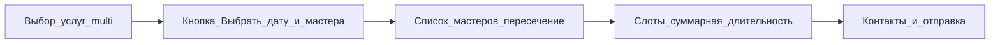

# Мульти-услуга в гостевой записи

## Контекст и ограничения сейчас

- Одна запись = один [`service_id`](backend/internal/infrastructure/persistence/model/models.go) в `appointments`.
- [`GuestBookingInput`](backend/internal/service/booking.go) и [`SlotParams`](backend/internal/service/booking.go) рассчитаны на **одну** услугу (`ServiceID *uuid.UUID`).
- [`GetAvailableSlots`](backend/internal/service/booking.go): длительность окна = одна услуга (+ оверрайд мастера через `GetServiceDurationOverride`).
- Список мастеров для салона уже **привязан к салону**: [`GET /api/v1/salons/:id/masters`](backend/internal/controller/salon_controller.go) → [`ListSalonMastersPublic`](backend/internal/service/master_public.go) с `services[]` из **`salon_master_services`** (не из «личного» маркетингового профиля мастера). Для фильтра «мастер умеет **все** выбранные услуги в этом салоне» достаточно пересечения по этому массиву на фронте или общего запроса на бэке.

## Целевой UX (как ты описал)

- Шаг 1: список услуг салона с **мультивыбором** (чекбоксы); кнопка внизу **«Выбрать дату и мастера»** — `disabled`, пока не выбрана хотя бы одна услуга; показывать **суммарные** длительность и цену (сумма `priceCents` из выбранных услуг салона; при необходимости позже — учитывать оверрайды мастера уже после выбора мастера).
- Шаг 2: мастера, у которых в **контексте салона** в `services` есть **каждая** из выбранных услуг (AND по множеству `serviceId`). Явно **не** использовать услуги только из публичного профиля мастера [`GET /api/v1/masters/:id`](backend/internal/controller/master_controller.go) для этого шага.
- Шаг 3: выбор даты/слота; **одно непрерывое окно** `[startsAt, endsAt)` длительностью **сумма** длительностей выбранных услуг для данного мастера (для каждой услуги: база из `services` + `salon_master_services.duration_override_minutes` если есть). Проверка конфликтов — как сейчас: пересечение с `appointments` того же `salon_master_id` (исключая отмены/no_show).
- Шаг 4: контакты и submit.

Порядок услуг внутри визита (влияет на «логику мастера», не на сумму минут): зафиксировать в UI порядок выбора или drag; для расчёта **длины блока** достаточно суммы минут; для будущих чек-листов мастера можно хранить `sort_order` в строках услуг.

## Хранение в БД (два варианта — ты выбрал «описать в плане»)

**Вариант A — рекомендуемый для одной полосы на календаре:** одна строка `appointments` (один `starts_at`/`ends_at`, один `salon_master_id`, один «главный» `service_id` для обратной совместимости или nullable после миграции) + таблица **`appointment_line_items`** (`appointment_id`, `service_id`, `sort_order`, snapshot цены/минут). Плюсы: один блок в UI, один `appointmentId` в ответе API. Минусы: миграция + доработка дашборда/отзывов при привязке отзыва к «визиту».

**Вариант B:** несколько строк `appointments` с общим **`booking_group_id`** (UUID), одинаковые guest/phone, времена подряд без зазора; суммарная длительность = сумма строк. Плюсы: меньше изменений в существующей модели `Appointment`. Минусы: в календаре несколько сегментов; сложнее атомарность и отображение «одна запись гостя».

Рекомендация для продукта: **вариант A**, если важна одна сущность «визит»; **вариант B** как быстрый MVP под капотом с последующей консолидацией в UI.

## Бэкенд

1. **Расширить расчёт слотов** в [`booking.go`](backend/internal/service/booking.go): новый вход (например `ServiceIDs []uuid.UUID`) или повторное использование `SlotParams` с полем «несколько услуг»; для каждого мастера вычислить `totalMinutes` = сумма `duration` по каждому `service_id` с учётом `GetServiceDurationOverride` для пары `(salonMasterID, serviceID)`; генерировать слоты с `slotEnd = slotStart + totalMinutes` и тем же шагом `slot_duration_minutes`, те же правила перерыва/сегодня+30мин.
2. **Публичный API слотов**: расширить [`listPublicSlots`](backend/internal/controller/salon_controller.go) — например повторяющийся query `serviceId` **или** один query `serviceIds` (CSV/JSON) с явной спецификацией в доке; при несовместимости с одной услугой сохранить обратную совместимость.
3. **`POST /bookings`**: тело с `serviceIds: []` (при одном элементе — эквивалент текущего `serviceId`); валидация: все услуги принадлежат салону; мастер покрывает все услуги в `salon_master_services`; атомарное создание строк (транзакция) по выбранному варианту A/B.
4. **Гонка слота**: при submit повторно проверить отсутствие пересечения в транзакции (как следующий шаг после трека 2).

## Фронтенд

- [`GuestBookingDialog.tsx`](frontend/src/features/guest-booking/ui/GuestBookingDialog.tsx): новые шаги/состояние — мультивыбор услуг, sticky/footer-кнопка «Выбрать дату и мастера», затем фильтр мастеров по пересечению `services` из [`fetchSalonMasters`](frontend/src/shared/api/salonApi.ts), затем [`PublicSlotPicker`](frontend/src/features/guest-booking/ui/PublicSlotPicker.tsx) с передачей нескольких `serviceId` (или нового контракта), отображение суммарных минут/цены.
- [`fetchPublicSlots`](frontend/src/shared/api/salonApi.ts) / [`SalonPage`](frontend/src/pages/salon/ui/SalonPage.tsx): только при необходимости прокинуть новые query-параметры.

## Документация

- Обновить [`docs/vault/architecture/`](docs/vault/architecture/overview.md) и [`docs/vault/product/status.md`](docs/vault/product/status.md) после выбора варианта A/B и контракта API.

## Порядок внедрения (после утверждения плана)

1. Миграция + модель хранения (A или B) и репозиторий создания.
2. `GetAvailableSlots` + тесты на суммарную длительность и конфликт с длинной записью.
3. HTTP: `GET .../slots` + `POST .../bookings`.
4. Фронт: wizard и интеграция.
5. Регрессия: одиночная услуга как `serviceIds` из одного элемента.

## Риски

- Дашборд и календарь ожидают одну услугу на событие — при варианте B визуально «лесенка»; при A — доработка отображения названия (например «Стрижка + окрашивание»).
- Оверрайды цены по мастеру для **каждой** услуги нужно суммировать согласованно с тем, как считает `effectivePriceCents` в публичном DTO мастера.
