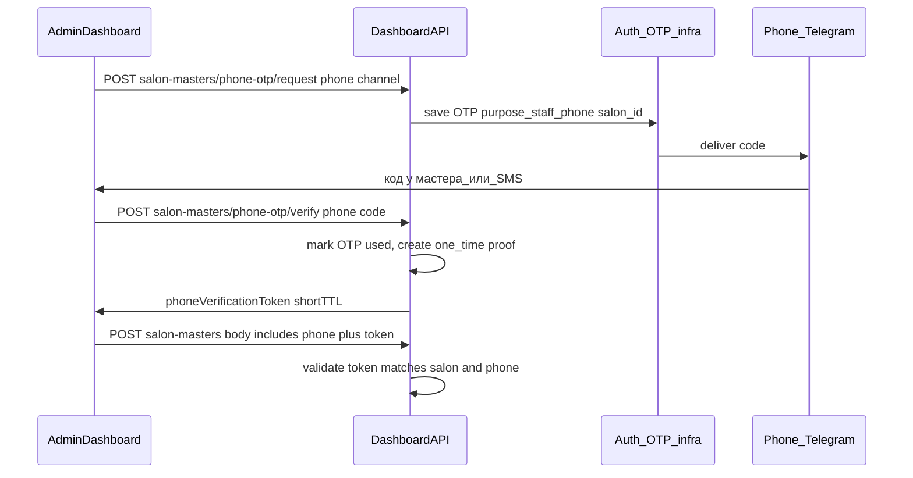

# План: OTP при указании/смене телефона мастера в дашборде

## Соответствие вашему требованию и таблице приоритетов

**Ваш формулировка** («владелец/админ вводит код, который приходит в Telegram или на телефон из формы создания/редактирования») — это ровно **пункт P1** из предложенной таблицы: **OTP на привязку телефона салоном** (доказательство номера в момент операции салона, не путать с P0 «не active без согласия» или P0 уникальность теней).

---

## Зачем нельзя просто переиспользовать `POST /api/auth/otp/verify`

[`VerifyOTP`](backend/internal/service/auth.go) при успехе **всегда** создаёт/находит `users`, выдаёт JWT и выполняет `tryClaimShadowMasterProfile`. Для сценария «админ подтверждает **чужой** номер сотрудника» это неверно: нужен **verify без входа** и с привязкой контекста `(salon_id, целевой phone_e164[, salon_master_id при edit])`.

Дополнительно: [`FindActiveOTP`](backend/internal/infrastructure/persistence/auth_repository.go) ищет последний активный OTP **только по телефону**. Если один и тот же номер параллельно запрашивает вход в приложение и подтверждение в дашборде, коды конкурируют. Нужно **развести по назначению** (`purpose` / отдельная таблица).

---

## Ц целевой поток (high-level)

---

## Backend

### 1. Хранение OTP с назначением

- Миграция: в [`otp_codes`](backend/migrations/000004_auth.up.sql) (или актуальная модель `OtpCode`) добавить поля, например:
  - `purpose` `TEXT NOT NULL DEFAULT 'login'` — значения: `login`, `staff_phone_bind`
  - `context_salon_id` `UUID NULL` — для `staff_phone_bind`
  - опционально `context_salon_master_id` `UUID NULL` для редактирования (чтобы proof не переносили на другую карточку)
- Обновить [`FindActiveOTP`](backend/internal/infrastructure/persistence/auth_repository.go): фильтр по `phone_e164` **и** `purpose` (и при необходимости по `context_salon_id`), по-прежнему `used = false`, срок, лимит попыток.
- [`RequestOTP`](backend/internal/service/auth.go): вынести общую логику генерации/сохранения/отправки; добавить метод **`RequestOTPForStaffPhoneBind(ctx, phone, channel, salonID, optionalStaffID)`** с `purpose = staff_phone_bind` (или отдельный сервисный слой в dashboard, но отправка кода — те же `smsSender` / `tgSender`).

**Telegram:** поведение как у логина: если канал `telegram`, существующий [`NewTelegramOTPSender`](backend/internal/service/auth.go) и ошибка `telegram_not_linked` — администратор видит то же ограничение: **код в Telegram возможен только если номер привязан к боту**; иначе SMS (когда появится провайдер) или сообщение об ошибке.

### 2. Verify без JWT + одноразовый proof

- Новые эндпоинты под префиксом dashboard (рядом с [`handleSalonMasters`](backend/internal/controller/dashboard_staff_handlers.go)), только для авторизованных членов салона:
  - `POST /api/v1/dashboard/salons/:id/salon-masters/phone-otp/request`
  - `POST /api/v1/dashboard/salons/:id/salon-masters/phone-otp/verify`
- Тело verify: `phone`, `code`, опционально `salonMasterId` при редактировании.
- При успехе: пометить OTP used; записать **одноразовый proof** (предпочтительно отдельная таблица `staff_phone_verification_proofs`: `id`, `salon_id`, `phone_e164`, `salon_master_id` nullable, `expires_at`, `used_at`, `created_by_user_id`) и вернуть клиенту **`phoneVerificationProofId`** (UUID) или короткоживущий подписанный JWT с теми же claims — на усмотрение реализации; UUID в БД проще отлаживать).
- TTL proof: 5–15 минут; **одно использование** при успешном `CreateStaff` / `UpdateStaff`.

### 3. Жёсткая проверка в `CreateStaff` / `UpdateStaff`

Файлы: [`dashboard_staff.go`](backend/internal/service/dashboard_staff.go), тип [`StaffInput`](backend/internal/service/dashboard_types.go).

- Добавить поле `PhoneVerificationProof *string` (`json:"phoneVerificationProof"`).
- **Требовать proof**, если после нормализации [`normalizePhoneE164Ptr`](backend/internal/service/dashboard_helpers.go) телефон **не пустой** и:
  - **create:** всегда (любой новый валидный телефон), или
  - **update:** новое значение `phone_e164` **отличается** от текущего на `salon_masters.phone` и/или `master_profiles.phone_e164` (для согласованности сравнивать нормализованные `+7…`; при `master_id` и теневом профиле — опираться на профиль как источник истины для публичного claim).
- Если телефон **очищается** (пустой ввод): отдельное продуктовое правило — либо proof **не** нужен, либо нужен (зафиксировать в плане реализации как **не требуем proof при сбросе телефона** для UX, с риском внимательно документировать).
- Перед записью: валидировать proof (салон, телефон, необязательное совпадение `salon_master_id`, не истёк, `used_at` NULL), затем пометить proof использованным.

Зависимости сервиса: `dashboardService` потребует доступ к репозиторию proof + расширенному OTP (инъекция через Fx).

### 4. Rate limiting и безопасность

- Переиспользовать лимит [`maxOTPPerMin`](backend/internal/service/auth.go) **на телефон** для `staff_phone_bind` (общий анти-спам с логином или отдельный счётчик — минимум тот же cooldown).
- Логировать `salon_id`, `actor_user_id`, целевой телефон (маскированно в логах при желании), результат.

---

## Frontend

- [`StaffFormModal.tsx`](frontend/src/pages/dashboard/ui/modals/StaffFormModal.tsx): при валидном телефоне в форме создания/редактирования — блок «Подтвердить номер»: канал (как в [`PhoneStep`](frontend/src/features/auth-by-phone/ui/PhoneStep.tsx)), кнопка «Отправить код», поле кода, затем вызов verify → сохранить `phoneVerificationProof` в state, отправить вместе с `POST/PUT salon-masters`.
- RTK Query в [`staffApi.ts`](frontend/src/entities/staff/model/staffApi.ts): новые мутации под request/verify + расширение типа тела сохранения.
- Если телефон изменился после успешного proof — сбрасывать proof (нужна повторная верификация).

---

## Документация

- Обновить [`docs/vault/entities/master-profiles-salon-masters.md`](docs/vault/entities/master-profiles-salon-masters.md) (путь 1: шаг OTP при наличии телефона).
- Короткая запись в [`docs/vault/product/status.md`](docs/vault/product/status.md) («Последние изменения»).
- При необходимости мини-ADR или дополнение к [`docs/vault/adr/0004-jwt-auth-with-otp.md`](docs/vault/adr/0004-jwt-auth-with-otp.md): OTP с полем `purpose`, не только login.

---

## Тесты и проверки

- Юнит-тесты: валидация `StaffInput` с/без proof; обновление телефона только с совпадающим proof.
- `go test ./...`, `npm run lint`, при затронутых типах — `npm run build`.

---

## Вне scope (следующие итерации)

- **P0** из таблицы: уникальность теневых `master_profiles` по `phone_e164` или автоматический reuse профиля — снижает дубли, но отдельная миграция и продуктовые правила.
- Push/SMS-провайдер в prod — по [`0004`](docs/vault/adr/0004-jwt-auth-with-otp.md) / `product/status.md` техдолг.
