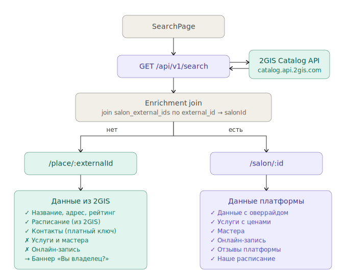

# Проверка Salon/Place и Master flow

Этот гайд помогает проверить проект с двух сторон:
- владелец/сотрудник (через dashboard),
- гость (публичные страницы салона/места и мастера).

Также здесь описано, как работает обогащение карточки салона, когда салон создает профиль на платформе.

## 1) Подготовка окружения

1. Запусти инфраструктуру:
   - `docker compose up -d`
2. Запусти backend и frontend:
   - backend: `cd backend && go run ./cmd/api`
   - frontend: `cd frontend && npm run dev`
3. Заполни dev-данные для проверок salon/place:
   - `make seed-salon-page-dev`

## 2) Основные URL для проверок

- Платформенный салон (UUID):  
  `http://localhost:5173/salon/11111111-1111-1111-1111-111111111111`
- Place (2GIS external id, redirect-кейс):  
  `http://localhost:5173/place/141373143068690`
- Dashboard салона:  
  `http://localhost:5173/dashboard`
- Публичная страница мастера:  
  `http://localhost:5173/master/:masterProfileId`

## 3) Проверка со стороны Dashboard (владелец/салон)

Проверь, что после входа в аккаунт салона:

- Открывается `DashboardPage` и доступны разделы:
  - обзор,
  - календарь,
  - записи,
  - услуги,
  - мастера,
  - расписание,
  - профиль.
- Изменения в профиле и услугах сохраняются и отображаются в публичном `SalonPage`.
- В календаре/записях можно:
  - увидеть существующие записи,
  - менять статус,
  - открыть детали записи.
- В разделе мастеров:
  - есть список мастеров салона,
  - корректно показываются публичные данные мастера.

Минимальная backend-проверка API dashboard (после авторизации):
- `GET /api/v1/dashboard/profile`
- `GET /api/v1/dashboard/appointments`
- `GET /api/v1/dashboard/services`
- `GET /api/v1/dashboard/staff`

## 4) Проверка со стороны гостя (публичный трафик)

### 4.1 Публичный салон `/salon/:id`

Открой `http://localhost:5173/salon/11111111-1111-1111-1111-111111111111` и проверь:

- рендерятся hero/типографика/карточки,
- видны услуги, контакты, расписание,
- вкладка мастеров загружается с API,
- гостевая запись отправляется через `POST /api/v1/salons/:id/bookings`.

### 4.2 Публичный place `/place/:externalId`

Открой `http://localhost:5173/place/141373143068690`:

- если внешний id связан с платформенным салоном, должен сработать redirect на `/salon/:id`,
- если связи нет, показывается place-режим страницы:
  - данные из 2GIS,
  - CTA "Позвонить",
  - без platform booking flow.

## 5) Как работает обогащение, если салон создал профиль у нас

Логика enrichment/redirect:

1. Пользователь открывает `/place/:externalId`.
2. Фронтенд делает два запроса:
   - детали place (2GIS),
   - lookup связи через `GET /api/v1/salons/by-external?source=2gis&id=:externalId`.
3. Если связь найдена (`salonId` существует), фронтенд делает `replace`-redirect на `/salon/:salonId`.
4. Дальше пользователь работает уже с платформенной страницей салона (наши услуги, мастера, букинг).

Технически связь хранится в таблице внешних идентификаторов (`salon_external_ids`), где внешний source/id сопоставлен с внутренним `salon_id`.

## 6) Схема роутинга search -> salon/place

Также см. исходную схему: `docs/search_to_salon_page_routing.svg`.

## 7) Страницы мастера: публичная страница и связь с user

### 7.1 Что такое публичная страница мастера

Публичная страница мастера доступна по роуту:
- `/master/:masterProfileId`

На ней отображаются:
- публичные данные профиля мастера,
- связанные салоны,
- услуги/направления (в зависимости от текущих данных профиля и членств).

### 7.2 Как мастер связан с аккаунтом user

Связка идет через `master_profiles.user_id`:

- `users` — аккаунт (авторизация, JWT),
- `master_profiles` — публичный профиль мастера, принадлежащий `user`,
- `salon_masters` — привязка профиля мастера к салонам (членства, статусы, роль в салоне).

Следствие:
- один `user` может иметь профиль мастера и работать в нескольких салонах;
- публичная страница строится по `masterProfileId`, но доступы в кабинет/действия проверяются через авторизованного `user`.

### 7.3 Что проверить руками по мастеру

1. Открыть страницу мастера по `masterProfileId` из вкладки "Мастера" на `SalonPage`.
2. Проверить, что:
   - профиль открывается без авторизации (публичный read),
   - видны связанные салоны и услуги.
3. Войти под пользователем-мастером и проверить:
   - `GET /api/auth/me` возвращает `masterProfileId`,
   - навигация показывает переход в кабинет мастера (`/master-dashboard`),
   - данные в кабинете мастера соответствуют тому же профилю.

## 8) Быстрый чеклист "готово / не готово"

- [ ] `seed-salon-page-dev` выполняется без ошибок
- [ ] `/salon/11111111-1111-1111-1111-111111111111` открывается и показывает данные
- [ ] `/place/141373143068690` корректно редиректит на связанный `/salon/:id`
- [ ] гостевая запись с публичной страницы салона уходит в API
- [ ] dashboard показывает актуальные сущности (записи/услуги/мастера)
- [ ] `/master/:masterProfileId` открывается и показывает публичный профиль
- [ ] `GET /api/auth/me` для мастера возвращает `masterProfileId`

