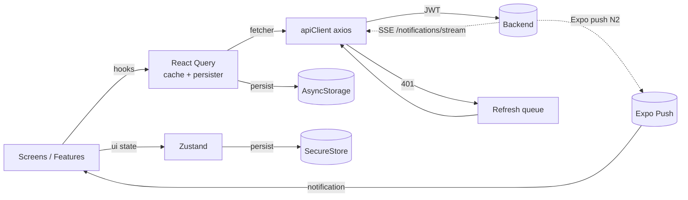
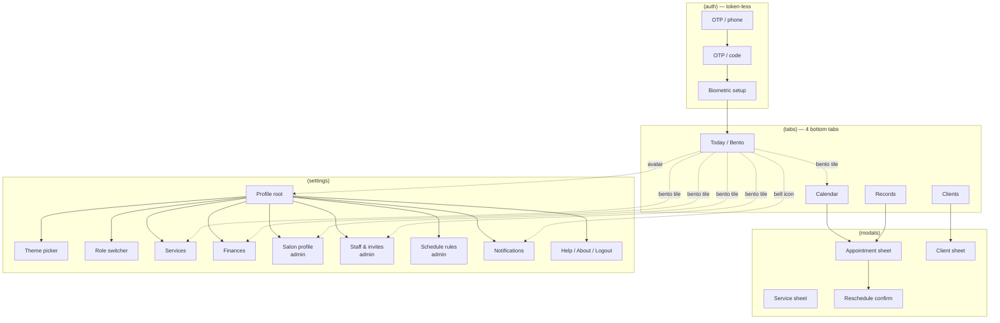
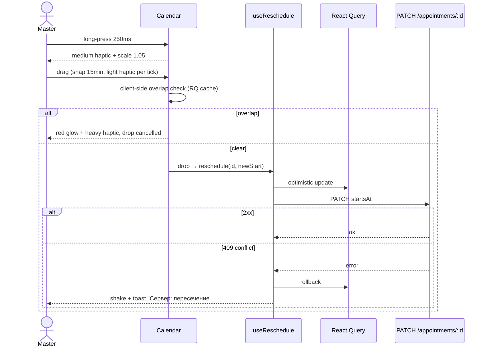

# Mobile App: UX/UI Redesign + Mock-to-API Replacement — Design Spec

**Date:** 2026-05-06
**Predecessor plan:** `docs/superpowers/plans/2026-05-05-react-native-mobile-app-design.md` (tasks 1–15 done; 16+ partially or unknown)
**Status:** Approved by user, ready for plan generation
**Owner:** Mobile / Backend
**Audience for plan:** subagent-driven-development or executing-plans

---

## 1. Goal & success criteria

Rebuild the operations mobile app under `mobile/` with a distinctive but operations-first UI, replace 100% of inline mocks with real backend APIs (creating new endpoints where needed), and ship a mobile calendar that is the best-in-class for in-salon work.

**Success criteria (binary, testable):**

1. Zero inline mock arrays / hardcoded fixtures in `mobile/src` and `mobile/app` (grep-enforceable in pre-commit).
2. Every visible screen pulls from real backend through React Query.
3. Calendar supports day / week / multi-master views, drag-to-reschedule with server-side conflict checks, long-press quick actions, now-line autoscroll, off-hours dimming.
4. Read-only offline cache: kill app + relaunch in airplane mode → user sees last-known schedule and clients with a clear staleness banner.
5. Theme catalog matches `frontend/src/shared/theme` architecture (id-based) — 4 light themes ship, dark/exotic themes pluggable later as data PRs.
6. App passes WCAG AA contrast checks for all 4 themes (unit-tested).
7. Login uses real OTP flow (`/api/auth/otp/request` + `/verify` + `/refresh`).
8. Push notifications actually deliver: appointment lifecycle events trigger Expo push reaching registered devices within ~10s.
9. Sentry catches JS errors and crashes with PII scrubbing in place.
10. Internal-only release pipeline (EAS → TestFlight + Google Play Internal Testing) green for a stable build.

**Non-goals:**

- Consumer-side mobile UX (search/booking) — separate future product.
- Optimistic offline mutations — explicitly read-only offline by decision.
- Multi-language UI — RU-only, but i18n infrastructure ready.
- Public store release — internal only.

---

## 2. Decisions captured during brainstorming

| #   | Question          | Choice                                                                                                                                                                                                                   |
| --- | ----------------- | ------------------------------------------------------------------------------------------------------------------------------------------------------------------------------------------------------------------------ |
| Q1  | Scope             | **B** — one app, two roles (`master` + `salon_admin`)                                                                                                                                                                    |
| Q2  | Visual direction  | Light Operations only, but theme catalog architecture for ~6 future themes incl. dark                                                                                                                                    |
| Q3  | Calendar features | A (Day-first) + drag-to-reschedule + long-press + multi-master + now-line autoscroll + off-hours dimming. Pinch-zoom and conflict-overlay → backlog                                                                      |
| Q4  | API strategy      | Hybrid (C): foundation fix first → per-screen replacement; required: N1 (today KPI) + N2 (real push delivery). Discovered during section 3/5 design: N3 (heatmap, required for month overview) and N4/N5 marked optional |
| Q5  | Non-functional    | 1.b read-only offline / 2.a i18n with ru.json / 3.a biometric lock / 4.a Sentry + base events / 5.a WCAG AA                                                                                                              |
| Q6  | Plan shape        | One large plan with phases / delete `Beautica_design/` / delete inline mocks fully / EAS internal-only release                                                                                                           |

**Distinctive design accents** (after user pushback against generic AI look):

- **Calistoga** display font ONLY for KPI numbers / hero amounts on dashboard
- **Soft luxe accent** (`#C9849F`) ONLY for VIP / new-client / favorite semantic dots and chips
- **Micro-interactions** as a first-class subsystem (hapatics + spring physics tokens), not afterthought
- **Bento Today screen** instead of fixed 5-tab + "More" — discoverability through tile hub

---

## 3. Architecture

### 3.1 Layers (FSD-style, mirrors `frontend/src`)

```
mobile/
├── app/                       # Expo Router
│   ├── _layout.tsx            # providers + auth gate + biometric gate
│   ├── (auth)/                # OTP stack
│   ├── (tabs)/                # 4 tabs: today/calendar/records/clients
│   ├── (modals)/              # full-screen sheets
│   └── (settings)/            # profile-stack
└── src/
    ├── api/                   # axios + endpoints + types
    ├── entities/<x>/          # api hooks, model, ui (cards/badges)
    ├── features/<x>/          # actions: create-appointment, reschedule…
    ├── shared/
    │   ├── theme/             # tokens.ts, themes.ts, ThemeProvider, useTheme
    │   ├── ui/                # Button/Input/Card/Sheet/Skeleton/Tag…
    │   ├── icons/             # Lucide adapter
    │   ├── haptics/           # useHaptics hook
    │   ├── motion/            # spring presets
    │   ├── i18n/              # i18next + ru.json
    │   ├── a11y/              # helpers
    │   ├── persist/           # AsyncStorage RQ persister + secure-store
    │   └── telemetry/         # Sentry init
    ├── stores/                # zustand: auth, theme, role
    └── providers/             # composition root
```

### 3.2 Data flow



### 3.3 Removals (clean break)

- `Beautica_design/` directory (rejected consumer mockup) — delete entirely.
- All inline arrays in `mobile/`: `DATA` in appointments.tsx, `CLIENTS` in clients.tsx, `events` in CalendarGrid.tsx, mock login in (auth)/login.tsx — delete during their respective screen migrations.
- Existing custom `mobile/src/components/calendar/CalendarGrid.tsx` — delete, replaced by `@howljs/react-native-calendar-kit` wrapper.
- Existing `mobile/src/theme/palettes.ts` — migrate seed values into new `themes.ts` then delete.

---

## 4. Information architecture

### 4.1 Screen map



### 4.2 Bottom tabs (4)

| Tab           | Content                                                                                                       | Roles                              |
| ------------- | ------------------------------------------------------------------------------------------------------------- | ---------------------------------- |
| **Сегодня**   | Bento hub: hero KPI + today timeline preview + tiles for Services/Finances/Salon/Staff/Notifications/Settings | both                               |
| **Календарь** | Day / Week / Multi-master timeline                                                                            | both (multi-master only for admin) |
| **Записи**    | List with filters: upcoming / past / cancelled / all                                                          | both                               |
| **Клиенты**   | Searchable list + segments (VIP / Regular / New / Churned)                                                    | both                               |

### 4.3 Bento tile role mapping

| Tile            |  master  | admin (single) |  admin (multi-salon)  |
| --------------- | :------: | :------------: | :-------------------: |
| Услуги          |   own    |     salon      |       per salon       |
| Финансы         | personal |     salon      | aggregate + per salon |
| Уведомления     |    ✓     |       ✓        |           ✓           |
| Салон / профиль |    —     |       ✓        |     ✓ + selector      |
| Сотрудники      |    —     |       ✓        |           ✓           |
| Расписание смен |    —     |       ✓        |           ✓           |
| Помощь          |    ✓     |       ✓        |           ✓           |

### 4.4 Header pattern

Avatar (40×40) left → `(settings)/profile`; title centered (DM Serif Display 22); bell icon right with unread badge → `(settings)/notifications`. Bell is **not a tab** — notifications are inbox-style, not destination.

### 4.5 Modals & deep links

- Bottom sheets via `@gorhom/bottom-sheet` (snap 30/60/90).
- Full-screen modals in `(modals)` group.
- Deep links: `/today`, `/calendar?date=…`, `/records/:id`, `/clients/:id`, `/notifications/:id`, etc. Critical for push-tap routing.

### 4.6 Empty / loading / error / offline / stale states (system-wide)

| State   | UI                              | Notes                    |
| ------- | ------------------------------- | ------------------------ |
| Loading | Skeleton (shimmer)              | only if response > 200ms |
| Empty   | Lucide icon + title + sub + CTA | sticky                   |
| Error   | Icon + msg + retry              | toast for background     |
| Offline | Top banner with timestamp       | persistent while offline |
| Stale   | Pulse-dot on refresh icon       | from RQ                  |

---

## 5. Calendar deep-dive

### 5.1 Library

**`@howljs/react-native-calendar-kit`** — chosen.

Reasons: built on FlashList + Reanimated + gesture-handler (already in `package.json`); native drag-to-create/edit; multi-resource mode for multi-master; haptic + pinch-zoom (free bonus though we deferred pinch); active maintenance through 2026.

Alternatives evaluated and rejected: `wix/react-native-calendars` (timeline UX dated), `react-native-big-calendar` (web-port), Planby/Mobiscroll/Syncfusion (web-first or paid). Custom Reanimated 4 timeline kept as escape-hatch only.

### 5.2 Three views

- **Day** (default for master): single column, configurable hours from salon settings (fallback 9–21), 15-min ticks, off-hours dimmed (`surface * 0.7`), now-line + autoscroll on mount, empty-slot tap = quick-create. Note: pinch-to-zoom is enabled by default in the chosen library but is **not a promoted feature** for v1 — we don't QA or document it (per Q3, deferred to backlog).
- **Week**: 7 columns, same hour scale, narrow events use initials + service tag.
- **Multi-master** (admin only): N columns per master, single day, drag between columns reassigns master AND time atomically. Uses `type="resource"` mode of calendar kit.

View toggle: segmented control top-right; multi-master hidden for master role.

### 5.3 Event color semantics

| Status              | Color                                          |
| ------------------- | ---------------------------------------------- |
| Confirmed           | `theme.accent` (охра)                          |
| Pending             | `theme.yellow` outline                         |
| Completed           | `theme.green` 50% opacity                      |
| Cancelled / no-show | `theme.red` strikethrough text                 |
| Held / block        | hatched `theme.muted`                          |
| **VIP client**      | normal status fill + `theme.luxe` 1.5px border |

Soft luxe (`#C9849F`) appears here for VIP semantic — its only calendar role.

### 5.4 Drag-to-reschedule flow



Server-side overlap is source of truth; client check is UX optimization.

### 5.5 Long-press → bottom sheet quick actions

40% snap, options: «Перенести» (drag mode), «Отметить пришла» (status=completed), «Отменить» (confirm dialog → cancelled), «Позвонить» (tel:), «Написать» (sms:), «Открыть карточку». Destructive actions confirmed; success haptics on safe ops.

### 5.6 Tap empty slot → quick-create

Half-sheet: time prefilled, duration from chosen service default, client (existing search + new), service. «Подробнее» button → full Appointment Sheet.

### 5.7 API hookup

```ts
useQuery({
  queryKey: ["appointments", { from, to, masterId, salonId }],
  queryFn: () =>
    api.get(MASTER.appointments, {
      params: { startsAfter: from, startsBefore: to, masterId, salonId },
    }),
  staleTime: 30_000,
});
```

Prefetch adjacent weeks on swipe via `queryClient.prefetchQuery`.

| Action        | Endpoint                                          |    Optimistic     |
| ------------- | ------------------------------------------------- | :---------------: |
| Reschedule    | `PATCH /master-dashboard/appointments/:id`        | ✓ rollback on err |
| Status change | `PATCH /master-dashboard/appointments/:id/status` |         ✓         |
| Create        | `POST /master-dashboard/appointments`             | — (skeleton card) |
| Cancel        | status patch with `cancelled`                     |         ✓         |
| Delete        | `DELETE …/appointments/:id`                       | ✓ + 5s undo toast |

### 5.8 Custom month heatmap (~150 LOC)

7×6 grid, opacity scaled to `appointmentsCount / maxPerDay`. Tap day → switch to Day view that date. Backend feed: **N3** new endpoint `/master-dashboard/appointments/heatmap?month=YYYY-MM`.

### 5.9 Performance targets

- 60fps drag on iPhone 12+ (Reanimated worklets).
- Auto-collapse if >100 events/day (overflow badge "+N").
- `keepPreviousData` prevents blank frames during navigation.

### 5.10 Edge cases

DST/timezone (UTC ISO + IANA), events crossing day boundary, drag past last hour (auto-scroll edge), simultaneous edits from two devices (409 → toast), missed appointments while app sleeping (push N2 + bell badge — no auto-status-change).

---

## 6. Theme system & design tokens

### 6.1 Architecture

```
mobile/src/shared/theme/
├── tokens.ts         # spacing/radii/motion/shadows/typography (theme-agnostic)
├── themes.ts         # THEMES[], THEMES_MAP, DEFAULT_LIGHT_ID
├── palette.types.ts  # Palette type (semantic roles)
├── ThemeProvider.tsx
├── useTheme.ts
└── ThemePicker.tsx
```

Mirrors `frontend/src/shared/theme`. `themeStore` (zustand) holds `themeId`, persisted to AsyncStorage.

### 6.2 Tokens

- **Spacing:** 4pt rhythm `0/2/4/6/8/12/16/20/24/32/40/48/64`.
- **Radii:** `none/sm 8/md 12/lg 16/xl 20/xxl 24/pill`. Cards default `lg`.
- **Typography fonts:** `DMSans` (body), `DMSerifDisplay` (screen titles), `Calistoga` (KPI numbers / hero amounts ONLY), `JetBrainsMono` (tabular figures only).
- **Type scale:** 11/12/14/16/18/22/28/36/48; weights 400/500/600/700/800; line-heights 1.2/1.35/1.5/1.65.
- **Motion springs:** fast (~120ms), base (~200ms), gentle (~280ms), bouncy (rewards). Duration tokens for non-spring: fast=120, base=200, slow=280, exit=140. `exit < enter` always.
- **Shadows / elevation:** 0–4 with neutral `#000`, never accent-colored.
- **Hit-slop:** sm 8 / base 12 / lg 16; expand 24×24 icons to 44×44pt effective.

### 6.3 Palette type (semantic roles)

```ts
type Palette = {
  id: string;
  label: string;
  kind: "light" | "dark";
  bg;
  surface;
  surfaceAlt;
  card: string;
  border;
  borderLight;
  borderInset: string;
  text;
  textSoft;
  muted;
  textInverse: string;
  accent;
  accentLight;
  accentBorder;
  accentText: string;
  luxe;
  luxeLight;
  luxeBorder: string;
  green;
  greenLight;
  red;
  redLight;
  yellow;
  yellowLight;
  blue;
  blueLight: string;
  navBg;
  statusBar: string;
  scrim: string;
};
```

### 6.4 Initial 4 light themes

| id                    | label       | accent    | luxe      | bg        |
| --------------------- | ----------- | --------- | --------- | --------- |
| `ivoryDate` (default) | Ivory Date  | `#B87A56` | `#C9849F` | `#F5F0E8` |
| `sandDune`            | Sand Dune   | `#B97830` | `#B97A95` | `#FAF7F2` |
| `slateStone`          | Slate Stone | `#B96E44` | `#B07A92` | `#F2F1EE` |
| `linenTea`            | Linen Tea   | `#9B7B5F` | `#B68FA1` | `#F4F1EC` |

All four pass WCAG AA (4.5:1 text/bg) — unit-tested.

### 6.5 Future-pluggable themes (not in this plan)

Slots reserved for `midnightTeal`, `graphiteRose`, `obsidianAmber` — same id-based system. `ThemeProvider` already handles `kind: 'dark'` (StatusBar + insets).

### 6.6 ThemePicker UX

`(settings)/theme`: tap preview = instant apply + success haptic + checkmark. "Скоро" disabled secondary list shows roadmap.

### 6.7 Component-level rules

- No hardcoded hex; only `useTheme().colors.*`. ESLint rule prevents regressions.
- Disabled = opacity 0.4 + cursor disabled.
- Pressed = scale 0.97 + opacity 0.85 + light haptic, via shared `<Tap>` wrapper.
- Skeleton = surface shimmer (no gradient).

### 6.8 Tests

- Snapshot: 4 themes × 5 key components.
- A11y unit: contrast(text, bg) ≥ 4.5 per theme.
- Visual smoke (Maestro): "login → switch theme → dashboard".

---

## 7. API replacement strategy

### 7.1 Foundation fix (Step 0, single PR before any screen migration)

- Fix `endpoints.ts`: paths now match real backend (no `/api/v1/auth/*` — actual is `/api/auth/otp/{request,verify}`, `/api/auth/refresh`, `/api/auth/me`, `/api/v1/me`, `/api/v1/master-dashboard/*`, `/api/v1/dashboard/*`).
- Fix `client.ts:refreshAccessToken()`: call `/api/auth/refresh`, not `/verify-otp`.
- Add `<QueryClientProvider>` + `<PersistQueryClientProvider>` with AsyncStorage persister, `maxAge: 24h`, `buster: APP_VERSION`.
- Add `<Sentry.ErrorBoundary>` at root.
- Add `<NetworkBanner>` and `useNetworkStatus()` (netinfo).
- Switch login to real OTP API.

### 7.2 Endpoint table (excerpt — full list in plan)

```ts
AUTH = { requestOTP, verifyOTP, refresh, me, logout }            // /api/auth/*
USER = { me }                                                     // /api/v1/me
MASTER = { appointments, appointment(id), apptStatus(id), services, service(id),
           clients, client(id), profile, financesSummary, expenseCategories, expenses,
           today /* N1 */, apptHeatmap /* N3 */, invites, salons }
SALON_ADMIN = { appointments, clients, services, staff, masters, invites, members,
                salon, schedule, slots, stats, phoneOtp, serviceCats }
NOTIFICATIONS = { list, unreadCount, markSeen(id), markAllSeen, markRead(id), markAllRead, stream }
DEVICES = { register }
```

### 7.3 React Query defaults

- `staleTime: 60_000`, `gcTime: 24h`, `retry: 2 (not on 401)`, `refetchOnReconnect: 'always'`, `refetchOnWindowFocus: false`.
- Mutations: `retry: 0`, blocked offline via `useGuardedMutation` wrapper.

### 7.4 Type generation

Strongly recommend **N4** (OpenAPI swagger in backend + `openapi-typescript` in mobile). If skipped, hand-written DTOs are kept in `mobile/src/api/types/` with strict review discipline.

### 7.5 Per-screen migration order (one PR each)

S1 Auth → S2 Profile/Me → S3 Today (Bento + Hero) → S4 Records list → S5 Calendar → S6 Clients → S7 Services → S8 Finances → S9 Notifications (incl. SSE stream) → S10 Salon admin extras.

Each PR's acceptance: real API used, mocks removed, error states ok, loading skeleton ok, RQ keys correct (no key collisions across roles), basic a11y (labels + 44pt + contrast).

### 7.6 New backend endpoints

#### N1. `GET /api/v1/master-dashboard/today`

KPI aggregator. Single SQL with CTE; uses `appointment.total_cents` (migration `000033` in-flight). Response shape:

```json
{
  "date": "2026-05-06",
  "appointmentsCount": 6,
  "revenueCents": 840000,
  "attendanceRatePct": 94,
  "nextAppointment": { "id", "startsAt", "clientName", "serviceName", "minutesUntil" },
  "schedulePreview": [{ "id", "startsAt", "endsAt", "clientName", "serviceName", "status" }],
  "weeklyAttendance": [80, 92, 100, 88, 94, null, null]
}
```

Tests: golden-file fixtures with mixed statuses.

#### N2. Real Expo push delivery

Worker `backend/internal/push/expo_pusher.go`. Triggers on domain events: `appointment.created` (third-party), `appointment.cancelled_by_client`, `appointment.rescheduled_by_other_party`, `notification.system`. Batched (≤100/req) Expo API calls; backoff 1s/5s/30s; receipt poll after 15min; on `DeviceNotRegistered` remove device row. Acceptance: ≤10s end-to-end push from event.

#### N3. `GET /api/v1/master-dashboard/appointments/heatmap?month=YYYY-MM`

Returns `{ month, days: [{date, count}], maxPerDay }`. Single SQL `GROUP BY date_trunc('day', starts_at)`. Test included.

#### N4 (recommended). OpenAPI swagger

Add `swaggo/swag` to backend; annotate controllers progressively (not a blocker for S1–S10). Mobile generates DTOs via `openapi-typescript`.

#### N5 (optional). Client segments in `/clients`

Add `lifetimeSpent`, `visitsCount`, `lastVisitAt`, `segment` to client response. Falls back to client-side computation if skipped (acceptable for <500 clients).

### 7.7 Error handling

```ts
class ApiError extends Error {
  status: number;
  code?: string;
  details?: any;
  isRetryable: boolean;
  userMessage(t): string; // localized user-facing message
}
```

Inline errors in forms; toasts for background async; banner for persistent network/auth issues; Sentry breadcrumbs auto via axios interceptor.

### 7.8 Done definition

- 0 inline mocks in `mobile/src` and `mobile/app` (grep-enforced pre-commit hook).
- `useAuthStore` synced with backend `me`.
- 401 → auto-refresh; refresh failure → logout + redirect.
- Persisted RQ cache visible after kill app + airplane mode.
- N1, N2, N3 deployed and tested.

---

## 8. Offline strategy

### 8.1 Persisted query allowlist

```
me, today, appointments, appointmentsHeatmap, clients, client, services,
financesSummary, notifications, notificationsUnread
```

Not persisted: tokens (SecureStore), OTP session, SSE events, form drafts, search suggestions.

### 8.2 Budget

| Setting               | Value                     |
| --------------------- | ------------------------- |
| `maxAge`              | 24h                       |
| `gcTime`              | 24h                       |
| `staleTime` (default) | 60s                       |
| Cache size            | ≤5MB AsyncStorage         |
| `buster`              | `EXPO_PUBLIC_APP_VERSION` |
| `throttleTime`        | 1000ms                    |

### 8.3 Indicators

| Context            | UI                                        |
| ------------------ | ----------------------------------------- |
| Online fresh       | nothing                                   |
| Online refetching  | pulse dot, non-blocking                   |
| Offline cache <1h  | grey banner "Без сети"                    |
| Offline cache >1h  | amber banner "Без сети — данные на HH:mm" |
| Offline no cache   | empty state with retry                    |
| Online sync failed | red banner, retry CTA                     |

### 8.4 Mutation block

`useGuardedMutation` wraps all writes; offline → toast + reject + disabled CTA states. No queue, no fake-success — explicit per Q5 1.b.

### 8.5 Conflict resolution

Read-only offline → no local writes to merge. Push-driven external change while offline → on reconnect refetch + bell-badge pulse + optional "record was updated externally" toast if currently open.

### 8.6 Edge cases

Corrupt AsyncStorage → wipe + Sentry breadcrumb; schema drift → buster sweep; expired token in cache → refresh-or-logout; >5MB → LRU eviction; long absence (>24h) → ignore persisted, refetch fresh; logout → `queryClient.clear()` + AsyncStorage wipe + secure-store wipe.

### 8.7 Tests

Detox/Maestro: "load → airplane → kill → re-open → cached visible with banner". Dev-only `Симулировать оффлайн` toggle in `(settings)/help` under `__DEV__`.

### 8.8 Anti-patterns (explicit)

No SQLite/WatermelonDB/Realm. No service worker. No mutation queue. No optimistic offline. No fake-success.

---

## 9. Cross-cutting

### 9.1 i18n

`i18next` + `react-i18next`. `locales/ru.json` only at launch, namespaced by feature. ICU plurals; `Intl` for numbers/dates/currency. ESLint `no-literal-string` for JSX. English (or any other) added later as PR with new locale file — UI infrastructure ready.

### 9.2 Accessibility (WCAG AA)

| Category           | Rule                                                                                          |
| ------------------ | --------------------------------------------------------------------------------------------- |
| Contrast           | text/bg ≥ 4.5 (small) / 3 (large 18pt+) — unit-tested per theme                               |
| Touch              | ≥ 44×44pt; hit-slop on small icons                                                            |
| Labels             | every Pressable has `accessibilityLabel`, role="button" on icons                              |
| VoiceOver order    | matches visual order — Detox a11y audit                                                       |
| Dynamic Type       | UI survives Largest (iOS) / xxxLarge (Android); titles capped via `maxFontSizeMultiplier=1.4` |
| Reduced motion     | `useMotion()` adjusts springs to opacity-only when system prefers reduced                     |
| Color-only meaning | always paired with icon/text                                                                  |
| Focus              | `accessibilityState`={selected, disabled, busy}                                               |
| Form errors        | `accessibilityLiveRegion="polite"`, auto-focus first invalid                                  |

Audit pass before each release: Xcode Accessibility Inspector + TalkBack on Android.

### 9.3 Biometric / app lock

`expo-local-authentication`. Cold start with token in SecureStore + biometricEnabled → BiometricGate; success → `(tabs)/today`. Background >5min triggers re-lock. After-login sheet "Включить Face ID?" with Skip/Enable.

`(settings)/security`: toggle biometric, choose timeout (5/15/60 min), "Logout all devices" (calls `/api/auth/logout` + wipes local state).

### 9.4 Telemetry (Sentry + base events)

`@sentry/react-native`, init pre-providers, prod/staging only, `tracesSampleRate: 0.1`. PII scrub in `beforeSend` (phone, email, names, clientId, userId stripped).

Event taxonomy:

- Crashes / JS errors / network errors — automatic.
- Performance traces: `today.load`, `calendar.day.load`, `appointment.create`.
- Product events: `auth.login_success/failure`, `appointment.create/reschedule/cancel`, `client.create`, `service.create`, `theme.changed`, `role.switched`, `notification.opened`.

User context: hashed userId only. Privacy toggle in `(settings)/about` (default ON, opt-out anywhere).

### 9.5 Bundle impact

i18next ~30KB · @sentry/react-native ~150KB · netinfo ~10KB. Total ~+200KB — acceptable.

---

## 10. Release & DevEx (Section 8 from brainstorm)

### 10.1 Environments

| Env                                      | API URL                                | Purpose                    |
| ---------------------------------------- | -------------------------------------- | -------------------------- |
| dev (Expo Go on dev machine)             | local backend (`http://<lan-ip>:8080`) | per-dev                    |
| staging (EAS build, internal)            | `https://staging-api.beautica.ru`      | preview / QA               |
| production (EAS build, internal channel) | `https://api.beautica.ru`              | TestFlight / Play Internal |

Env vars exposed via `EXPO_PUBLIC_*`: `API_URL`, `SENTRY_DSN`, `APP_VERSION`, `BUILD_NUMBER`, `ENV`.

Prefer EAS-managed secrets over committed `.env.production` — rotate `mobile/.env.production` to reference `eas.json` profile envs.

### 10.2 Build pipeline (EAS)

`eas.json` profiles:

```json
{
  "build": {
    "development": { "developmentClient": true, "distribution": "internal" },
    "staging": { "channel": "staging", "distribution": "internal" },
    "production": {
      "channel": "production",
      "distribution": "internal",
      "ios": { "autoIncrement": true },
      "android": { "autoIncrement": true }
    }
  },
  "submit": {
    "production": {
      "ios": {
        "appleId": "FILLED_DURING_RELEASE_SETUP",
        "ascAppId": "FILLED_DURING_RELEASE_SETUP"
      },
      "android": { "track": "internal" }
    }
  }
}
```

EAS Update for OTA on JS-only changes; native changes require new build.

### 10.3 Versioning

Semver `MAJOR.MINOR.PATCH` in `mobile/app.json`. `BUILD_NUMBER` auto-incremented by EAS. Convention:

- PATCH = bugfix only
- MINOR = new feature, backward compatible
- MAJOR = breaking schema (rare; will trigger RQ buster sweep)

### 10.4 Per-phase release cadence

Phases (see §11) each end with a staging build to TestFlight / Play Internal:

| Phase                                        | Tag                           |
| -------------------------------------------- | ----------------------------- |
| Foundation done                              | v0.5.0-staging                |
| Today + Records online                       | v0.6.0-staging                |
| Calendar online                              | v0.7.0-staging                |
| Clients + Services online                    | v0.8.0-staging                |
| Notifications + Finances + Admin extras      | v0.9.0-staging                |
| Polish (offline + biometric + Sentry + a11y) | v1.0.0-rc1 → testers → v1.0.0 |

`v1.0.0` = first production-channel release on TestFlight + Play Internal Testing.

### 10.5 CI

GitHub Actions:

- On PR: lint + typecheck + jest
- On merge to `master`: bump build number, run EAS build for staging
- Manual workflow `eas-submit` to push to internal stores

### 10.6 Crash dashboard / smoke ops

Sentry release tracking enabled (`release: mobile@VERSION+BUILD`). Each staging build watched for 24h before promoting tag.

---

## 11. Phasing (high-level — detailed plan in writing-plans output)

| Phase                                          | Output                                                                                                                                                                                                                                                                                   | Rough size  |
| ---------------------------------------------- | ---------------------------------------------------------------------------------------------------------------------------------------------------------------------------------------------------------------------------------------------------------------------------------------- | ----------- |
| **0. Foundation**                              | endpoints fix, RQ provider + persister, Sentry, NetworkBanner, theme catalog (4 light), tokens, ThemePicker, real OTP login, biometric setup screen, i18n init with skeleton ru.json, Lucide icons, haptics hook, motion tokens, delete `Beautica_design/`, delete inline mocks scaffold | 1–1.5 weeks |
| **1. Read screens online**                     | S2 me / S3 Today (incl. backend N1) / S4 Records list — all reading real API, with skeletons + offline banner                                                                                                                                                                            | 1 week      |
| **2. Calendar**                                | S5: integrate `@howljs/react-native-calendar-kit`, day/week/multi-master, drag-flow with optimistic + 409 rollback, long-press sheet, quick-create, autoscroll, off-hours dim, custom heatmap (+N3 endpoint), prefetch adjacent                                                          | 1.5 weeks   |
| **3. Clients + Services**                      | S6 / S7 with empty-state onboarding for solo masters                                                                                                                                                                                                                                     | 0.5 weeks   |
| **4. Notifications + Finances + Admin extras** | S8 / S9 (incl. SSE) / S10 + N2 push delivery worker on backend                                                                                                                                                                                                                           | 1 week      |
| **5. Polish & release**                        | i18n key sweep, a11y audit, biometric polish, Sentry tuning, performance profiling, offline e2e test, release pipeline, internal-only TestFlight + Play Internal, v1.0.0                                                                                                                 | 0.5–1 week  |

**Total:** ~5–6.5 weeks single-developer estimate.

Each phase ends with: (a) staging build deployed, (b) brief smoke-test checklist run, (c) Sentry watched 24h, (d) merged to main.

---

## 12. Risks & mitigations

| Risk                                                                        | Mitigation                                                                       |
| --------------------------------------------------------------------------- | -------------------------------------------------------------------------------- |
| `@howljs/react-native-calendar-kit` constraints we hit only at multi-master | Kept custom Reanimated 4 timeline as escape-hatch in plan; fall back if blocking |
| Real Expo push (N2) delivery flakes                                         | 3-step backoff retry + receipt polling + Sentry alerts on >5% failure rate       |
| OpenAPI generation (N4) blocks API replacement                              | Optional — proceed with hand-written types if backend swag setup slow            |
| AsyncStorage 5MB cap exceeded for large clients/appointments                | LRU eviction (built-in); allowlist already excludes search/SSE volatiles         |
| Biometric edge cases on Android (BiometricPrompt API differences)           | Test matrix: Pixel + Samsung + budget device; fallback to OTP always available   |
| Theme switching breaks navigation (StatusBar style mismatch)                | `ThemeProvider` updates `StatusBarStyle` via effect; tested in snapshot          |
| Russian plural rules for ICU                                                | Unit-test message formatting for 0/1/2/5/21/22 cases                             |

---

## 13. Open questions (none blocking)

- Whether to host fonts (Calistoga, JetBrainsMono) via Expo Font rather than pulling at runtime — likely yes, decided during foundation phase.
- Whether SSE on RN works without polyfill for current Expo SDK 54 — verify in S9; fallback is poll every 30s for unread-count.
- Whether backend `appointment` model already exposes `total_cents` consistently across `master-dashboard` and `dashboard` (the in-flight migration `000033` should handle this) — confirm before N1 implementation.

---

## 14. Acceptance for this spec → plan handoff

Before the writing-plans skill runs:

- [x] User approved scope (Q1=B)
- [x] User approved visual direction (Q2 with extensible catalog)
- [x] User approved calendar features (Q3 = A + 1+2+3+4+7)
- [x] User approved API approach (Q4 = C + N1 + N2)
- [x] User approved non-functional reqs (Q5 = 1.b + 2.a + 3.a + 4.a + 5.a)
- [x] User approved plan shape (Q6 = 1.a + 2.a + 3.a + 4.a)
- [x] User approved sectioned design 1–7 explicitly; section 8 delegated
- [x] **User reviews this written spec** ← gate before plan generation

---

## 15. Notes for the plan writer

- Single plan with phases (per Q6 1.a). Use phase headings; each phase contains task list with checkboxes.
- Each task names files to create/modify and tests to add.
- Backend tasks (N1/N2/N3 and optional N4/N5) live in early phases of their dependent screen-phase, not isolated at end.
- Per-screen tasks include: "delete inline mock", "wire React Query hook", "loading skeleton", "empty state", "error state", "a11y labels", "i18n keys", "Sentry event".
- Migration of `palettes.ts` → `themes.ts` happens once in Foundation phase; PRs after must use `useTheme()`.
- Pre-commit hook (`grep` for inline arrays in screens) should be added as part of Foundation tasks.
