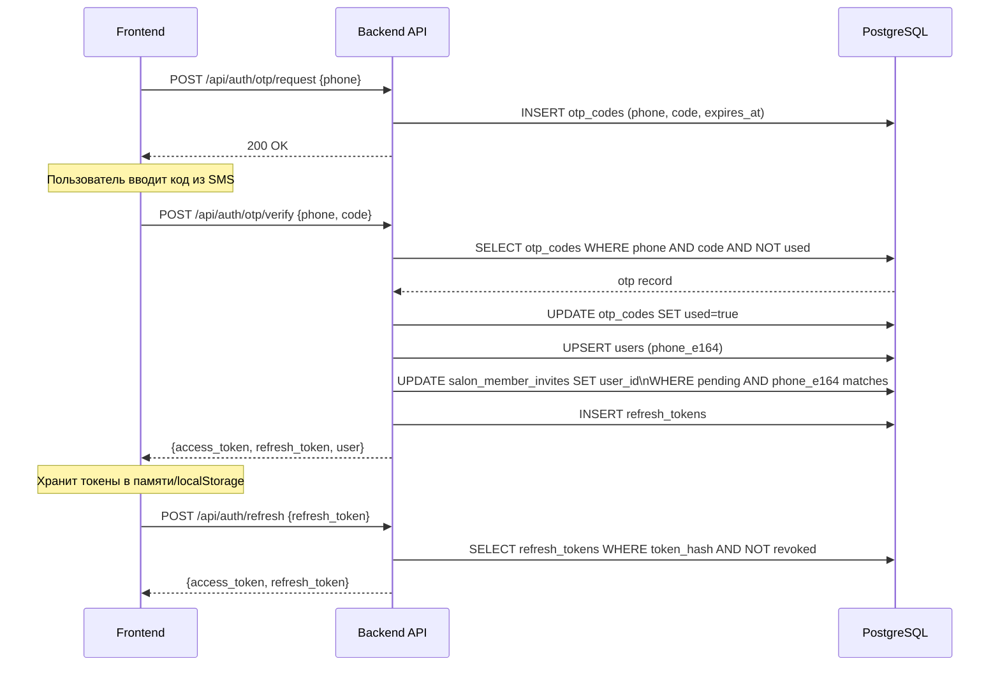
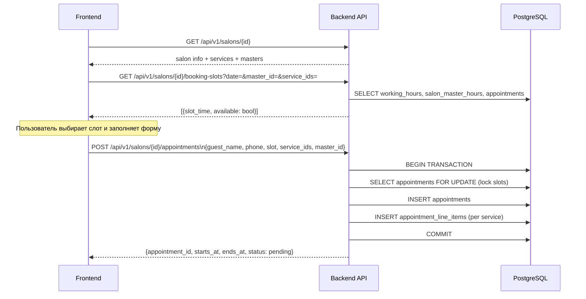
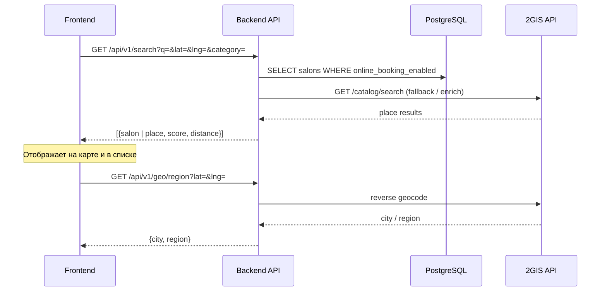
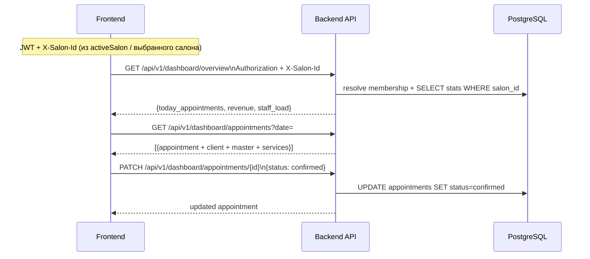
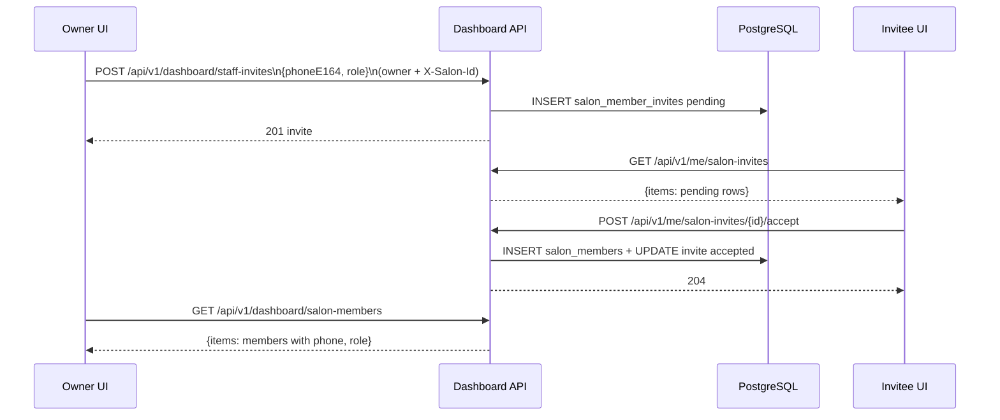

# API Flows

Sequence-диаграммы ключевых сценариев. Источник: `backend/internal/controller/server.go`.

---

## 1. Аутентификация по номеру телефона

---

## 2. Гостевое бронирование (мультисервис)

---

## 3. Поиск салонов / мест

---

## 4. Дашборд салона (авторизованный)

Все запросы к **`/api/v1/dashboard/*`** (кроме явных исключений в коде) требуют:

- заголовок **`Authorization: Bearer <access>`**;
- заголовок **`X-Salon-Id: <uuid>`** — салон, в котором проверяется членство (`salon_members`) и роль (`owner` | `admin` | `receptionist`) для RBAC.

---

## 5. Персонал салона и инвайты членов

Инвайты в **`salon_member_invites`** (миграция **`000024_staff_management`**). После **`POST /api/auth/otp/verify`** pending-строки с тем же `phone_e164` получают **`user_id`** (пользователь всё равно принимает приглашение явно).

---

## Маршруты API (сводка)

| Группа | Путь | Auth |
|--------|------|------|
| Health | `GET /health` | — |
| Auth | `POST /api/auth/otp/request` | — |
| Auth | `POST /api/auth/otp/verify` | — |
| Auth | `POST /api/auth/refresh` | — |
| Auth | `GET /api/auth/me` | JWT |
| Salons | `GET /api/v1/salons` | — |
| Salons | `/api/v1/salons/{id}/*` | — |
| Masters | `/api/v1/masters/{id}/*` | — |
| Search | `GET /api/v1/search` | — |
| Geo | `GET /api/v1/geo/region\|cities\|reverse` | — |
| Places | `GET /api/v1/places/search` | — |
| Dashboard | `/api/v1/dashboard/*` | JWT + **X-Salon-Id** |
| Me | `/api/v1/me`, `/api/v1/me/sessions/*`, **`/api/v1/me/salon-invites`** (GET; `.../accept` / `.../decline` POST) | JWT |
| Master Dashboard | `/api/v1/master-dashboard/*` | JWT |

## Связанные заметки

- [[overview]] ([overview.md](overview.md)) — архитектура системы
- [[db-schema]] ([db-schema.md](db-schema.md)) — схема БД
- [[frontend]] ([frontend.md](frontend.md)) — React-компоненты
