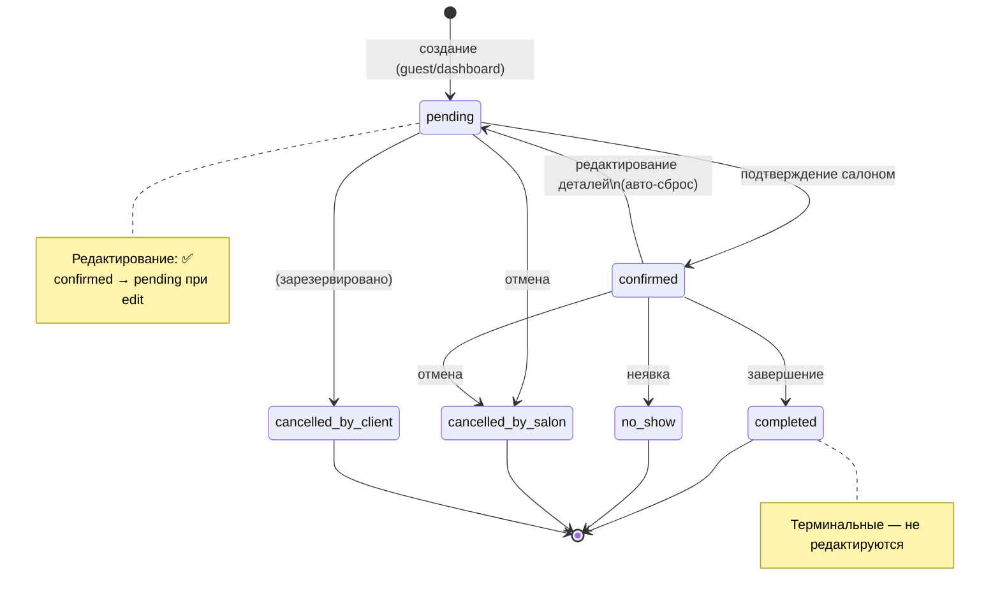
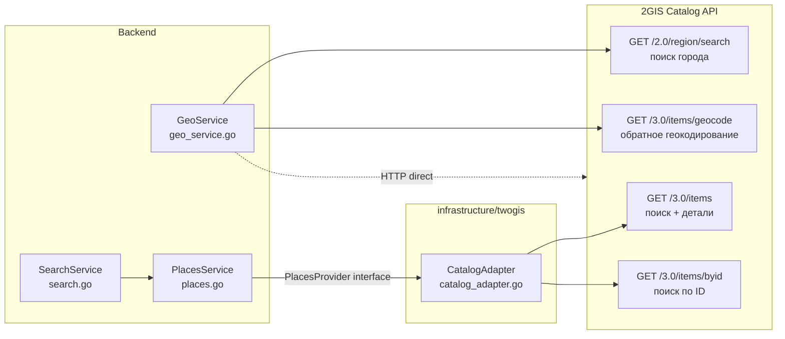

# Backend — детальная архитектура

Go-бэкенд. Источник: `backend/internal/`. DI через `uber/fx`. Полное дерево файлов (снимок) — `docs/archive/architecture-monolith-2026-04-24.md` §1; для работы используй [`code-map.md`](code-map.md).

---

## DI-граф (Uber Fx)

Полный граф зависимостей из `backend/internal/app/app.go`.

```mermaid
graph TD
    subgraph Infra["Инфраструктура"]
        CFG["config.Load"]
        LOG["applogger.New"]
        DB["persistence.NewDB\n(GORM + PostgreSQL)"]
        JWT["auth.NewJWTManager\n(HS256)"]
        TWOGIS["twogis.NewCatalogAdapter\nas PlacesProvider"]
    end

    subgraph Repos["Репозитории (persistence)"]
        R_HEALTH["NewHealthRepository"]
        R_SALON["NewSalonRepository"]
        R_APPT["NewAppointmentRepository"]
        R_DASH["NewDashboardRepository"]
        R_INVITES["NewSalonMemberInviteRepository"]
        R_MASTER_PUB["NewMasterPublicRepository"]
        R_MASTER_DASH["NewMasterDashboardRepository"]
        R_CLIENT["NewSalonClientRepository"]
        R_AUTH["NewAuthRepository"]
        R_SLOTS["NewBookingSlotsRepository"]
    end

    subgraph Services["Сервисы (бизнес-логика)"]
        S_HEALTH["NewHealthService"]
        S_SALON["NewSalonService"]
        S_PLACES["NewPlacesService"]
        S_SEARCH["NewSearchService"]
        S_GEO["NewGeoService"]
        S_BOOKING["NewBookingService"]
        S_DASH["NewDashboardService"]
        S_MASTER_PUB["NewMasterPublicService"]
        S_MASTER_DASH["NewMasterDashboardService"]
        S_CLIENT["NewSalonClientService"]
        S_AUTH["NewAuthService"]
    end

    subgraph Controllers["Контроллеры (HTTP)"]
        C_HEALTH["NewHealthController"]
        C_SALON["NewSalonController"]
        C_PLACES["NewPlacesController"]
        C_SEARCH["NewSearchController"]
        C_GEO["NewGeoController"]
        C_AUTH["NewAuthController"]
        C_DASH["NewDashboardController"]
        C_MASTER["NewMasterController"]
        C_MASTER_DASH["NewMasterDashboardController"]
        C_CLIENT["NewSalonClientController"]
        SERVER["NewHTTPServer"]
    end

    DB --> R_HEALTH & R_SALON & R_APPT & R_DASH & R_INVITES
    DB --> R_MASTER_PUB & R_MASTER_DASH & R_CLIENT & R_AUTH & R_SLOTS

    R_HEALTH --> S_HEALTH
    R_SALON --> S_SALON
    TWOGIS --> S_PLACES
    S_PLACES --> S_SEARCH
    R_SALON --> S_SEARCH
    S_GEO -.->|uses| TWOGIS
    R_SLOTS --> S_BOOKING
    R_APPT --> S_BOOKING
    R_DASH --> S_DASH
    R_INVITES --> S_DASH
    R_INVITES --> S_AUTH
    R_MASTER_PUB --> S_MASTER_PUB
    R_MASTER_DASH --> S_MASTER_DASH
    R_CLIENT --> S_CLIENT
    R_AUTH --> S_AUTH
    JWT --> S_AUTH

    S_HEALTH --> C_HEALTH
    S_SALON --> C_SALON
    S_BOOKING --> C_SALON
    S_MASTER_PUB --> C_SALON
    S_PLACES --> C_PLACES
    S_SEARCH --> C_SEARCH
    S_GEO --> C_GEO
    S_AUTH --> C_AUTH
    S_DASH --> C_DASH
    S_CLIENT --> C_CLIENT
    S_MASTER_PUB --> C_MASTER
    S_MASTER_DASH --> C_MASTER_DASH

    C_HEALTH & C_SALON & C_PLACES & C_SEARCH & C_GEO & C_AUTH & C_DASH & C_MASTER & C_MASTER_DASH & C_CLIENT --> SERVER
    JWT --> SERVER
```

---

## Структура пакета service/ (разбивка god-file)

DashboardService разбит на доменные файлы (рефакторинг 2026-04-21 + персонал 2026-04-27):

```mermaid
graph LR
    DS["DashboardService\n(public interface)"]

    DS --> DA["dashboard_appointment.go\nCRUD записей\nмашина состояний"]
    DS --> DSC["dashboard_schedule.go\nрасписание\nслоты"]
    DS --> DSM["dashboard_service_mgmt.go\nуслуги\nкатегории"]
    DS --> DST["dashboard_staff.go\nмастера\nmaster-invites"]
    DS --> DP["dashboard_personnel.go\nsalon-members\nstaff-invites\n/me invites"]
    DS --> DSTAT["dashboard_stats.go\nстатистика"]
    DS --> DH["dashboard_helpers.go\nобщие хелперы"]
    DS --> DTP["dashboard_types.go\nDTO и типы"]

    style DS fill:#1a2d1a,stroke:#3fb950
```

---

## Машина состояний Appointment

---

## Алгоритм расчёта слотов (BookingService)

```mermaid
flowchart TD
    START([GetAvailableSlots]) --> SALON[GetSalonMeta\nslot_duration_minutes, timezone]
    SALON --> MASTERS{мастер задан?}
    MASTERS -->|да| ONE[GetSalonMaster\nили GetSalonMasterByProfileID]
    MASTERS -->|нет| ALL[ListSalonMastersCoveringServices\nфильтр: все услуги у мастера]
    ONE & ALL --> FOR_MASTER[для каждого мастера]
    FOR_MASTER --> HOURS[GetMasterWorkingHour\nsalon_master_hours day_of_week]
    HOURS --> DAYOFF{is_day_off?}
    DAYOFF -->|да| SKIP[пропустить день]
    DAYOFF -->|нет| DUR[GetMasterServiceOverrides\nлиния услуг + оверрайды\nсуммарная duration_minutes]
    DUR --> BUSY[FindByMasterInRange\nзанятые окна из appointments\nисключить cancelled_* no_show]
    BUSY --> SLOTS[генерация сетки\nopens_at → closes_at шаг slot_duration_minutes]
    SLOTS --> FILTER[фильтр пересечений\nперерыв breakStartsAt/breakEndsAt\nзанятые окна\nпрошедшее время + 30min]
    FILTER --> RESULT([список слотов + мастера])

    style START fill:#1f4068
    style RESULT fill:#1a2d1a
```

---

## HTTP-роуты (полная таблица)

```mermaid
graph LR
    subgraph PUBLIC["Публичные"]
        R1["GET /health"]
        R2["GET /api/v1/salons"]
        R3["GET /api/v1/salons/{id}"]
        R4["GET /api/v1/salons/{id}/masters"]
        R5["GET /api/v1/salons/{id}/slots"]
        R6["POST /api/v1/salons/{id}/bookings"]
        R7["GET /api/v1/masters/{id}"]
        R8["GET /api/v1/search"]
        R9["GET /api/v1/places/search"]
        R10["GET /api/v1/places/item/{id}"]
        R11["GET /api/v1/geo/region|cities|reverse"]
        R12["POST /api/auth/otp/request"]
        R13["POST /api/auth/otp/verify"]
        R14["POST /api/auth/refresh"]
    end

    subgraph JWT["JWT Required"]
        R15["GET /api/auth/me"]
        R16["POST /api/auth/logout"]
        R17["ANY /api/v1/dashboard/*\n(+ X-Salon-Id)"]
        R18["ANY /api/v1/master-dashboard/*"]
        R19["GET|POST /api/v1/me/salon-invites*"]
    end

    subgraph DASH["Dashboard sub-routes"]
        D1["GET|POST /appointments"]
        D2["PUT|PATCH /appointments/{id}"]
        D3["GET|POST /services"]
        D4["GET /service-categories"]
        D5["GET|POST|PUT|DELETE /salon-masters"]
        D6["PUT /salon-masters/{id}/services"]
        D7["GET /masters/lookup?phone="]
        D8["POST /master-invites"]
        D9["GET /schedule"]
        D10["GET /stats"]
        D11["GET|PUT /salon/profile"]
        D12["GET /slots"]
        D13["GET /clients"]
        D14["GET|PUT /clients/{id}"]
        D15["GET /clients/{id}/appointments"]
        D16["GET|POST /clients/tags"]
        D17["POST|DELETE /clients/{id}/tags"]
        D18["POST /clients/{id}/merge"]
        D19["GET|PATCH|DELETE /salon-members\n(owner)"]
        D20["GET|POST|DELETE /staff-invites\n(owner)"]
    end

    R17 --> DASH
```

---

## Внешние зависимости

> ⚠️ Данные 2GIS **не кешируются в БД** (лицензия). Только реалтайм-запросы.

---

## Конфигурация (env vars)

| Переменная | Default | Описание |
|------------|---------|----------|
| `HTTP_ADDR` | `:8080` | Порт |
| `DATABASE_DSN` | local postgres | DSN |
| `JWT_SECRET` | ⚠️ `dev-secret-change-me` | 🔴 Сменить перед prod! |
| `2GIS_API_KEY` | — | Обязателен |
| `2GIS_REGION_ID` | `32` (Москва) | ID региона |
| `LOG_LEVEL` | `development` | zap log level |

## Связанные заметки

- [[overview]] ([overview.md](overview.md)) — высокоуровневая архитектура
- [[db-schema]] ([db-schema.md](db-schema.md)) — схема БД
- [[api-flows]] ([api-flows.md](api-flows.md)) — sequence-диаграммы
- [[product/status]] ([status.md](../product/status.md)) — текущий статус разработки
