# Схема базы данных

ER-диаграмма PostgreSQL. Источник: `backend/internal/infrastructure/persistence/model/models.go`.

```mermaid
erDiagram
    users {
        uuid id PK
        string phone_e164 UK
        string display_name
        enum global_role "client|admin"
        timestamp created_at
    }

    salons {
        uuid id PK
        string name_override
        string address
        string timezone
        bool online_booking_enabled
        string salon_type
        string business_type "venue|freelancer"
        float lat
        float lng
        string photo_url
        float cached_rating
        int slot_duration_minutes
        timestamp created_at
    }

    salon_external_ids {
        uuid salon_id FK
        string source PK
        string external_id UK
        jsonb meta
        timestamp synced_at
    }

    salon_members {
        uuid salon_id FK
        uuid user_id FK
        enum role "owner|admin|staff"
    }

    master_profiles {
        uuid id PK
        uuid user_id FK
        string display_name
        string avatar_url
        text[] specializations
        int years_experience
        float cached_rating
        bool is_active
        timestamp created_at
    }

    master_services {
        uuid id PK
        uuid master_id FK
        string name
        string category_slug
        int price_cents
        int duration_minutes
        bool is_active
    }

    salon_masters {
        uuid id PK
        uuid salon_id FK
        uuid master_id FK
        string display_name
        bool dashboard_access
        bool is_active
        enum status "active|inactive"
        timestamp created_at
    }

    services {
        uuid id PK
        uuid salon_id FK
        string name
        string category_slug
        int duration_minutes
        int price_cents
        bool is_active
    }

    salon_master_services {
        uuid staff_id FK
        uuid service_id FK
        int price_override_cents
        int duration_override_minutes
    }

    appointments {
        uuid id PK
        uuid salon_id FK
        uuid client_user_id FK
        uuid salon_master_id FK
        uuid service_id FK
        uuid salon_client_id FK
        string guest_name
        string guest_phone_e164
        timestamp starts_at
        timestamp ends_at
        enum status "pending|confirmed|completed|cancelled"
        timestamp created_at
    }

    appointment_line_items {
        uuid id PK
        uuid appointment_id FK
        uuid service_id FK
        string service_name
        int duration_minutes
        int price_cents
        int sort_order
    }

    salon_clients {
        uuid id PK
        uuid salon_id FK
        uuid user_id FK
        string phone_e164
        string display_name
        string notes
        timestamp created_at
    }

    working_hours {
        uuid id PK
        uuid salon_id FK
        int day_of_week
        time opens_at
        time closes_at
        bool is_closed
    }

    salon_master_hours {
        uuid id PK
        uuid staff_id FK
        int day_of_week
        time opens_at
        time closes_at
        bool is_day_off
    }

    salon_subscriptions {
        uuid id PK
        uuid salon_id FK
        enum plan
        enum status "active|trialing|cancelled"
        timestamp current_period_end
    }

    otp_codes {
        uuid id PK
        string phone_e164
        string code
        timestamp expires_at
        bool used
    }

    refresh_tokens {
        uuid id PK
        uuid user_id FK
        string token_hash
        timestamp expires_at
        bool revoked
    }

    reviews {
        uuid id PK
        uuid appointment_id FK
        int rating
        string body
        timestamp created_at
    }

    salons ||--o{ salon_external_ids : "external IDs"
    salons ||--o{ salon_members : "members"
    salons ||--o{ salon_masters : "staff"
    salons ||--o{ services : "catalog"
    salons ||--o{ working_hours : "schedule"
    salons ||--o{ appointments : "bookings"
    salons ||--o{ salon_clients : "clients"
    salons ||--o| salon_subscriptions : "subscription"

    salon_masters ||--o{ salon_master_services : "offers"
    salon_masters ||--o{ salon_master_hours : "schedule"
    services ||--o{ salon_master_services : "linked to"

    appointments ||--o{ appointment_line_items : "items"
    appointments ||--o| reviews : "review"

    users ||--o{ salon_members : "member of"
    users ||--o{ appointments : "books"
    users ||--o{ refresh_tokens : "sessions"

    master_profiles ||--o{ master_services : "personal catalog"
    master_profiles ||--o{ salon_masters : "works at"
```

## Ключевые особенности

- **SalonMaster** — мост между `salons` и `master_profiles`. `master_id` может быть NULL (shadow-профиль, созданный салоном).
- **AppointmentLineItem** — снапшот услуг на момент бронирования; поддерживает мультисервисный гостевой флоу.
- **SalonClient** — CRM-запись клиента внутри салона; может быть связан с `users` или существовать независимо.
- **salon_subscriptions** — тарифный план салона (фаза 2).

## Связанные заметки

- [[overview]] ([overview.md](overview.md)) — архитектура системы
- [[api-flows]] ([api-flows.md](api-flows.md)) — API sequence-диаграммы
