# Схема базы данных

ER-диаграмма PostgreSQL. Источник: `backend/internal/infrastructure/persistence/model/models.go`.

```mermaid
erDiagram
    users {
        uuid id PK
        string phone_e164 UK
        string display_name
        enum global_role "client|salon_owner|master|advertiser|admin"
        timestamp created_at
    }

    salons {
        uuid id PK
        string name_override
        string address
        string timezone
        bool online_booking_enabled
        string salon_type "legacy; fallback for salonCategoryScopes"
        string business_type "legacy; venue|individual"
        float lat
        float lng
        string photo_url
        float cached_rating
        int slot_duration_minutes
        timestamp created_at
    }

    salon_external_ids {
        uuid salon_id FK
        string source PK
        string external_id UK
        jsonb meta
        timestamp synced_at
    }

    salon_members {
        uuid salon_id FK
        uuid user_id FK
        enum role "owner|admin|receptionist"
    }

    salon_member_invites {
        uuid id PK
        uuid salon_id FK
        string phone_e164
        enum role "admin|receptionist"
        enum status "pending|accepted|declined|expired"
        uuid invited_by FK
        uuid user_id FK
        timestamptz created_at
        timestamptz expires_at
    }

    master_profiles {
        uuid id PK
        uuid user_id FK
        string display_name
        string avatar_url
        text[] specializations
        int years_experience
        float cached_rating
        bool is_active
        timestamp created_at
    }

    master_services {
        uuid id PK
        uuid master_id FK
        string name
        string category_slug
        int price_cents
        int duration_minutes
        bool is_active
    }

    salon_masters {
        uuid id PK
        uuid salon_id FK
        uuid master_id FK
        string display_name
        text[] specializations
        bool dashboard_access
        bool is_active
        enum status "active|inactive"
        timestamp created_at
    }

    services {
        uuid id PK
        uuid salon_id FK
        string name
        string category_slug
        int duration_minutes
        int price_cents
        bool is_active
    }

    salon_master_services {
        uuid staff_id FK
        uuid service_id FK
        int price_override_cents
        int duration_override_minutes
    }

    appointments {
        uuid id PK
        uuid salon_id FK "nullable"
        uuid master_profile_id FK "for personal appts"
        uuid client_user_id FK
        uuid salon_master_id FK
        uuid service_id "salon: FK services; personal: master_services (trigger)"
        uuid salon_client_id FK
        string guest_name
        string guest_phone_e164
        timestamp starts_at
        timestamp ends_at
        enum status "pending|confirmed|completed|cancelled"
        timestamp created_at
    }

    master_clients {
        uuid id PK
        uuid master_id FK
        uuid user_id FK
        string phone_e164
        string display_name
        string notes
        string extra_contact
        timestamp created_at
    }

    appointment_line_items {
        uuid id PK
        uuid appointment_id FK
        uuid service_id FK
        string service_name
        int duration_minutes
        int price_cents
        int sort_order
    }

    salon_clients {
        uuid id PK
        uuid salon_id FK
        uuid user_id FK
        string phone_e164
        string display_name
        string notes
        timestamp created_at
    }

    working_hours {
        uuid id PK
        uuid salon_id FK
        int day_of_week
        time opens_at
        time closes_at
        bool is_closed
    }

    salon_master_hours {
        uuid id PK
        uuid staff_id FK
        int day_of_week
        time opens_at
        time closes_at
        bool is_day_off
    }

    salon_subscriptions {
        uuid id PK
        uuid salon_id FK
        enum plan
        enum status "active|trialing|cancelled"
        timestamp current_period_end
    }

    otp_codes {
        uuid id PK
        string phone_e164
        string code
        timestamp expires_at
        bool used
    }

    refresh_tokens {
        uuid id PK
        uuid user_id FK
        string token_hash
        timestamp expires_at
        bool revoked
    }

    reviews {
        uuid id PK
        uuid appointment_id FK
        int rating
        string body
        timestamp created_at
    }

    salon_claims {
        uuid id PK
        uuid user_id FK
        enum relation_type "owner|manager|representative"
        text comment
        string source
        string external_id
        text snapshot_name
        text snapshot_address
        string snapshot_phone
        text snapshot_photo
        enum status "pending|approved|rejected|duplicate"
        text rejection_reason
        uuid reviewed_by FK
        timestamptz reviewed_at
        uuid salon_id FK
        timestamptz created_at
        timestamptz updated_at
    }

    salons ||--o{ salon_external_ids : "external IDs"
    salons ||--o{ salon_members : "members"
    salons ||--o{ salon_member_invites : "member invites"
    salons ||--o{ salon_masters : "staff"
    salons ||--o{ services : "catalog"
    salons ||--o{ working_hours : "schedule"
    salons ||--o{ appointments : "bookings"
    salons ||--o{ salon_clients : "clients"
    salons ||--o| salon_subscriptions : "subscription"

    master_profiles ||--o{ master_services : "personal catalog"
    master_profiles ||--o{ master_clients : "personal clients"
    master_profiles ||--o{ salon_masters : "works at"
    master_profiles ||--o{ appointments : "personal bookings"

    salon_masters ||--o{ salon_master_services : "offers"

    users ||--o{ salon_claims : "submits"
    salons ||--o{ salon_claims : "claimed via"
```

## Ключевые особенности

- **SalonMaster** — мост между `salons` и `master_profiles`. `master_id` может быть NULL (shadow-профиль, созданный салоном). Содержит `specializations` для роли в конкретном салоне.
- **MasterClient** — личная клиентская база мастера (`master_profiles.id`).
- **Appointment** — поддерживает салонные записи (`salon_id` задан) и личные (`salon_id` IS NULL, `master_profile_id` задан). Для личных записей `service_id` указывает на `master_services.id` (проверка триггером `services_same_salon_as_appointment`); для салонных — на `services.id`. Внешний ключ с `services` для колонки снят (миграция `000030_personal_appointment_service_check`).
- **AppointmentLineItem** — снапшот услуг на момент бронирования; поддерживает мультисервисный гостевой флоу.
- **SalonClient** — CRM-запись клиента внутри салона; может быть связан с `users` или существовать независимо.
- **salon_subscriptions** — тарифный план салона (фаза 2).
- **SalonClaim** — заявка владельца на привязку 2GIS-места к платформе. `UNIQUE INDEX` на `(user_id, source, external_id) WHERE status IN ('pending','approved')` гарантирует один активный claim на пользователя × место. При approve — атомарная транзакция создаёт `salons` + `salon_external_ids` + `salon_members(owner)` + `salon_subscriptions(free/trial)`. Конкурирующие pending-заявки других пользователей помечаются `duplicate`. Migration: `000020_salon_claims`.
- **salon_member_invites** — приглашение в `salon_members` по телефону; роль не может быть `owner` (CHECK). После OTP для существующего пользователя строки с тем же `phone_e164` могут получить `user_id` для списка «Мои приглашения»; принятие — отдельный вызов API. Migration: **`000024_staff_management`**.
- **notifications** — in-app уведомления пользователя: `type`, `title`, `body`, `data` (JSONB), `is_read` / `read_at`, **`seen_at`** (отдельно от прочтения), индексы по непрочитанным и «невидимым». Связанные таблицы: **`notification_preferences`**, **`telegram_outbox`** (очередь на будущую доставку в Telegram). Migrations: **`000025_notifications`**, **`000026_notifications_seen`** (индекс и выравнивание `seen_at`). Спека: [`entities/notifications.md`](../entities/notifications.md).
- **salons.onboarding_completed** — флаг первичного онбординга (добавлен в migration 000020). Для владельца: `false` → редирект на **`/dashboard/:salonId/onboarding`** (см. фронт `OnboardingWizard`).

## Связанные заметки

- [[overview]] ([overview.md](overview.md)) — архитектура системы
- [[api-flows]] ([api-flows.md](api-flows.md)) — API sequence-диаграммы
