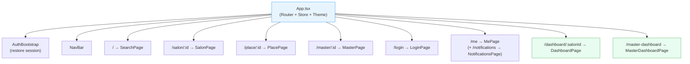
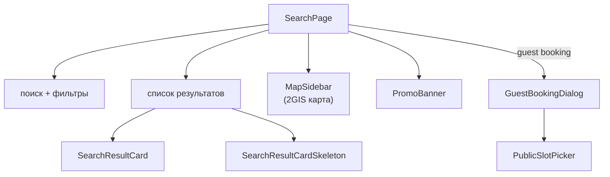
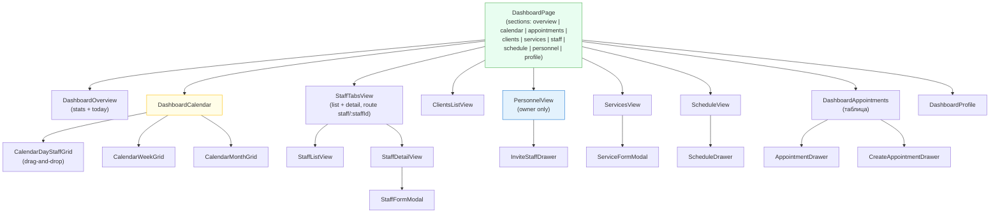
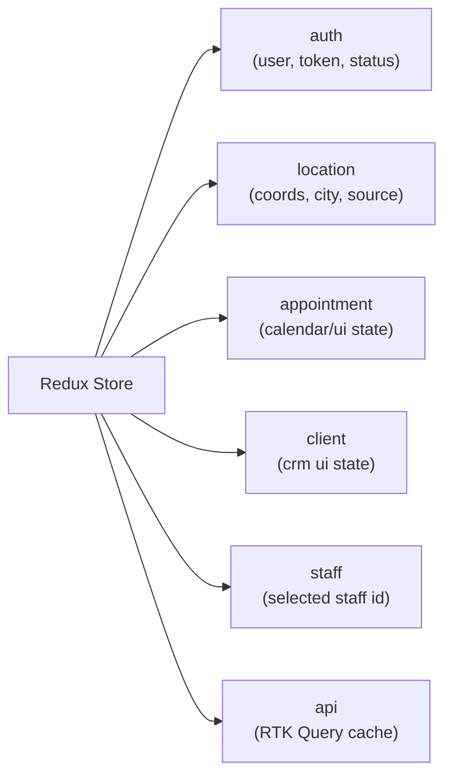

# Frontend — структура компонентов

Архитектура React-приложения. Источник: `frontend/src/`. Структура по Feature-Sliced Design. См. также [`code-map.md`](code-map.md).

---

## Дерево страниц и роутинг

---

## SearchPage — публичная карта

---

## DashboardPage — управление салоном

Маршрут: **`/dashboard/:salonId`** (`?section=…` для вкладок; деталь мастера — **`/dashboard/:salonId/staff/:staffId`**). Заголовок **`X-Salon-Id`** для запросов к `/api/v1/dashboard/*` задаётся через `getActiveSalonId()` / `setActiveSalonId()` (`shared/lib/activeSalon.ts`).

Механика контекста салона:

- роут (`/dashboard/:salonId/...`) — источник салона для UI-навигации;
- `setActiveSalonId(salonId)` синхронизирует выбранный салон в runtime/local storage;
- API-запросы идут на `/api/v1/dashboard/*` и несут `X-Salon-Id` в заголовке;
- если запрос передаёт `X-Salon-Id` явно (через `headers`), `authFetch` не должен перетирать его значением из `activeSalonId`.

Практика дебага в Network tab:

- URL запроса может не содержать `salonId` (`/api/v1/dashboard/appointments`);
- фактический контекст салона смотри в `Request Headers -> X-Salon-Id`;
- при расследовании «не тот салон в ответе» первым делом сверяй пару: `route salonId` vs `X-Salon-Id`.

---

## Слои FSD (Feature-Sliced Design)

```mermaid
graph LR
    subgraph pages
        SearchPage2["search"]
        DashboardPage2["dashboard"]
        SalonPage2["salon"]
        MasterPage2["master"]
        LoginPage2["login"]
    end

    subgraph features
        AuthByPhone["auth-by-phone\n(OTP flow)"]
        GuestBooking["guest-booking\n(PublicSlotPicker)"]
        Location["location\n(coordinates store)"]
    end

    subgraph entities
        Salon["salon\n(SalonCard, types)"]
        Place["place\n(PlaceCard)"]
        Search["search\n(SearchResultCard)"]
        Appointment["appointment\n(AppointmentBlock)"]
        Client["client\n(CRM entity api/slice)"]
        Staff["staff\n(RTK Query + slice)"]
        SalonInvite["salon-invite\n(personnel RTK)"]
        UserAppt["user-appointment\n(мои визиты, RTK Query)"]
        MasterFin["master-finances\n(финансы мастера, RTK Query + slice)"]
    end

    subgraph shared
        API["api/\n(authApi, dashboardApi,\nsalonApi, searchApi...)"]
        UIKit["ui/\n(NavBar, DataGrid, StarRow)"]
        Config["config/\n(routes, featureFlags)"]
        Store["store.ts\n(Redux Toolkit)"]
    end

    pages --> features
    pages --> entities
    features --> entities
    entities --> shared
    pages --> shared
```

---

## Redux Store — слайсы

---

## API-клиенты → эндпоинты

| Файл | Эндпоинт | Используется в |
|------|----------|---------------|
| `authApi.ts` | `/api/auth/*` | auth-by-phone feature |
| `salonApi.ts` | `/api/v1/salons/*` | SalonPage, GuestBooking |
| `searchApi.ts` | `/api/v1/search` | SearchPage |
| `dashboardApi.ts` | `/api/v1/dashboard/*` | DashboardPage |
| `rtkApi.ts` | `/api/v1/dashboard/*` (base query + **Authorization**, **X-Session-Id**, **X-Salon-Id**) | entities/* RTK Query |
| `entities/staff/model/staffApi.ts` | `/salon-masters`, `/masters/lookup`, `/master-invites` | DashboardPage → StaffTabsView |
| `entities/salon-invite/model/personnelApi.ts` | `/salon-members`, `/staff-invites` | `PersonnelView`, `InviteStaffDrawer` |
| `meApi.ts` | `/api/v1/me`, `/api/v1/me/salon-invites`, accept/decline | `MePage` → `SalonInvitesSection` |
| `entities/user-appointment/model/userAppointmentApi.ts` | `GET /api/v1/me/appointments` (pagination) | `MePage` → `AppointmentsSection` |
| `masterDashboardApi.ts` | `/api/v1/master-dashboard/*` | MasterDashboardPage |
| `entities/master-finances/model/masterFinancesApi.ts` | `/api/v1/master-dashboard/finances/*` | `MasterFinancesPage` |
| `geoApi.ts` | `/api/v1/geo/*` | location feature |
| `placesApi.ts` | `/api/v1/places/*` | SearchPage |
| `clientsApi.ts` | `/api/v1/dashboard/clients/*` | DashboardPage → Clients |

---

## E2E инфраструктура (Playwright flow-runner)

В репозитории есть отдельный контур `frontend/e2e/` с декларативными сценариями:

- `scenarios/flows.yaml` — сценарии и шаги;
- `tests/flow-runner.spec.ts` — генератор тестов из YAML;
- `actions/index.ts` + `actions/*.actions.ts` — реестр и реализации действий;
- `helpers/api-helpers.ts` — подготовка данных через `/api/dev/e2e/seed-salon`;
- `playwright.config.ts` — webServer-подъём backend/frontend для e2e.

---

## Кабинет мастера — раздел «Финансы»

`MasterDashboardPage` поддерживает секцию `?section=finances`, которая рендерит `MasterFinancesPage`.

- Данные загружаются через `entities/master-finances/model/masterFinancesApi.ts` (summary, trends, top services, expenses, categories, export).
- Локальный UI-state периода/источника хранится в `masterFinances` slice (`financesSlice.ts`, подключён в `app/store.ts`).
- Для инвалидации графиков и списков используются RTK-теги: `FinanceSummary`, `FinanceCategories`, `FinanceExpenses`.

## Связанные заметки

- [[overview]] ([overview.md](overview.md)) — архитектура системы
- [[api-flows]] ([api-flows.md](api-flows.md)) — sequence-диаграммы API
- [[db-schema]] ([db-schema.md](db-schema.md)) — схема БД
