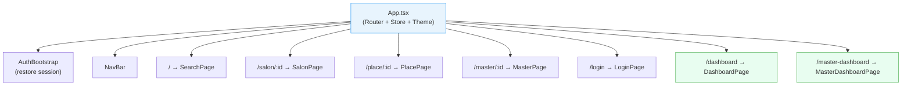
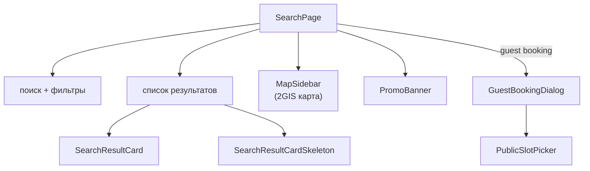
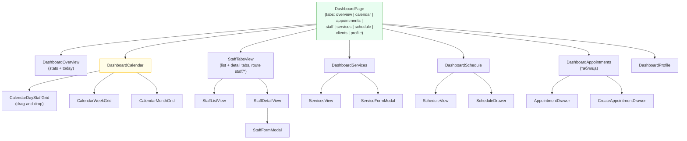
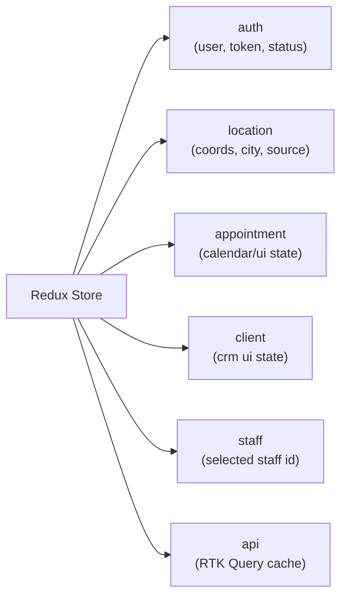

# Frontend — структура компонентов

Архитектура React-приложения. Источник: `frontend/src/`. Структура по Feature-Sliced Design. См. также [`code-map.md`](code-map.md).

---

## Дерево страниц и роутинг

---

## SearchPage — публичная карта

---

## DashboardPage — управление салоном

---

## Слои FSD (Feature-Sliced Design)

```mermaid
graph LR
    subgraph pages
        SearchPage2["search"]
        DashboardPage2["dashboard"]
        SalonPage2["salon"]
        MasterPage2["master"]
        LoginPage2["login"]
    end

    subgraph features
        AuthByPhone["auth-by-phone\n(OTP flow)"]
        GuestBooking["guest-booking\n(PublicSlotPicker)"]
        Location["location\n(coordinates store)"]
    end

    subgraph entities
        Salon["salon\n(SalonCard, types)"]
        Place["place\n(PlaceCard)"]
        Search["search\n(SearchResultCard)"]
        Appointment["appointment\n(AppointmentBlock)"]
        Client["client\n(CRM entity api/slice)"]
        Staff["staff\n(RTK Query endpoints + slice)"]
    end

    subgraph shared
        API["api/\n(authApi, dashboardApi,\nsalonApi, searchApi...)"]
        UIKit["ui/\n(NavBar, DataGrid, StarRow)"]
        Config["config/\n(routes, featureFlags)"]
        Store["store.ts\n(Redux Toolkit)"]
    end

    pages --> features
    pages --> entities
    features --> entities
    entities --> shared
    pages --> shared
```

---

## Redux Store — слайсы

---

## API-клиенты → эндпоинты

| Файл | Эндпоинт | Используется в |
|------|----------|---------------|
| `authApi.ts` | `/api/auth/*` | auth-by-phone feature |
| `salonApi.ts` | `/api/v1/salons/*` | SalonPage, GuestBooking |
| `searchApi.ts` | `/api/v1/search` | SearchPage |
| `dashboardApi.ts` | `/api/v1/dashboard/*` | DashboardPage |
| `rtkApi.ts` | `/api/v1/dashboard/*` (base query + auth headers) | entities/* RTK Query |
| `entities/staff/model/staffApi.ts` | `/salon-masters`, `/masters/lookup`, `/master-invites` | DashboardPage → StaffTabsView |
| `masterDashboardApi.ts` | `/api/v1/master-dashboard/*` | MasterDashboardPage |
| `geoApi.ts` | `/api/v1/geo/*` | location feature |
| `placesApi.ts` | `/api/v1/places/*` | SearchPage |
| `clientsApi.ts` | `/api/v1/dashboard/clients/*` | DashboardPage → Clients |

## Связанные заметки

- [[overview]] ([overview.md](overview.md)) — архитектура системы
- [[api-flows]] ([api-flows.md](api-flows.md)) — sequence-диаграммы API
- [[db-schema]] ([db-schema.md](db-schema.md)) — схема БД
