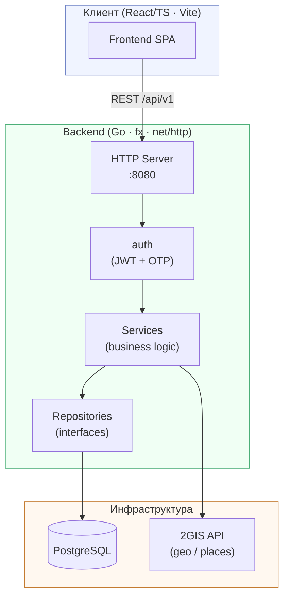

# Архитектура системы

Высокоуровневая схема сервисов и их взаимодействия. Указатели в код: [`code-map.md`](code-map.md).

## Слои бэкенда

| Слой | Папка | Отвечает за |
|------|-------|------------|
| Controllers | `internal/controller` | HTTP-роутинг, decode/encode |
| Services | `internal/service` | Бизнес-логика |
| Repositories | `internal/repository` | Интерфейсы доступа к данным |
| Persistence | `internal/infrastructure/persistence` | Реализации репозиториев (GORM) |
| Auth | `internal/auth` | JWT, middleware |

## Связанные заметки

- [[db-schema]] ([db-schema.md](db-schema.md)) — ER-диаграмма базы данных
- [[api-flows]] ([api-flows.md](api-flows.md)) — sequence-диаграммы ключевых API
- [[frontend]] ([frontend.md](frontend.md)) — дерево React-компонентов
