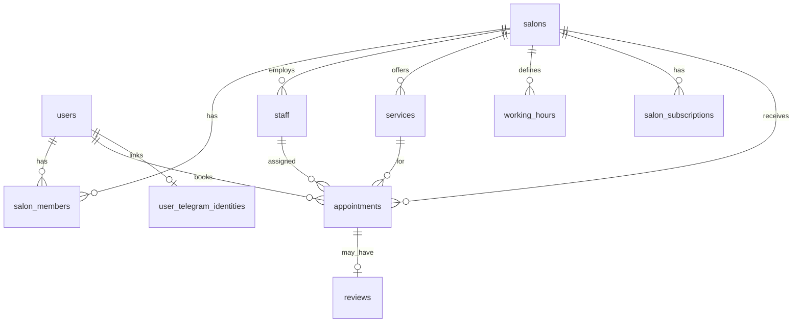

# Схема таблиц и сущностей (PostgreSQL)

Контекст: [docker-compose.yml](docker-compose.yml) поднимает `postgres:16`, БД `beauty`. [backend/main.go](backend/main.go) пока без слоя БД — схема задаёт целевую модель для миграций (например `golang-migrate` или `goose`).

## Принципы

- **2GIS / справочник:** в Postgres не дублируем «каталог организаций» из API. Храним только **внешний идентификатор** (`external_source` + `external_id`) и **наши** поля: описание, медиа, услуги, расписание, записи, клейм.
- **Роли:** один физический человек может быть и клиентом, и владельцем салона — проще моделировать через `users` + отдельные связи (`salon_members`), а не жёстко одна роль на пользователя.
- **Мастера:** в MVP по [docs/vault/product/context.md](docs/vault/product/context.md) «несколько мастеров в салоне» нет в продукте, но сущность `staff` (мастер) даёт FK для `appointments` и не ломает UI «один салон = один поток записей» (одна запись по умолчанию на «дефолтного» мастера или `staff_id` nullable до появления UI).

## Ядро MVP

### `users`

| Колонка        | Тип                    | Назначение                   |
| -------------- | ---------------------- | ---------------------------- |
| `id`           | `uuid` PK              |                              |
| `phone_e164`   | `text` UNIQUE NOT NULL | Вход по телефону             |
| `display_name` | `text` nullable        | Имя клиента / как показывать |
| `created_at`   | `timestamptz`          |                              |

Индекс: `UNIQUE(phone_e164)`.

### `salons`

Клеймленный салон + привязка к справочнику.

| Колонка                  | Тип                                     | Назначение                                   |
| ------------------------ | --------------------------------------- | -------------------------------------------- |
| `id`                     | `uuid` PK                               |                                              |
| `external_source`        | `text` NOT NULL                         | Например `2gis`                              |
| `external_id`            | `text` NOT NULL                         | ID организации у провайдера                  |
| `name_override`          | `text` nullable                         | Если отличается от справочника               |
| `address_override`       | `text` nullable                         | Редко; координаты лучше не дублировать       |
| `timezone`               | `text` NOT NULL DEFAULT `Europe/Moscow` | Слоты и записи                               |
| `description`            | `text` nullable                         |                                              |
| `phone_public`           | `text` nullable                         | Контакт для клиентов                         |
| `online_booking_enabled` | `boolean` NOT NULL DEFAULT false        | Только платный тариф / ручной флаг на старте |
| `created_at`             | `timestamptz`                           |                                              |

Ограничение: `UNIQUE(external_source, external_id)` — один клейм на организацию.

### `salon_members`

Связь пользователь ↔ салон (владелец, админ, позже — администратор сети).

| Колонка    | Тип                                 |
| ---------- | ----------------------------------- |
| `salon_id` | `uuid` FK → `salons`                |
| `user_id`  | `uuid` FK → `users`                 |
| `role`     | `text` или `enum`: `owner`, `admin` |
| PK         | `(salon_id, user_id)`               |

### `staff`

Мастер в салоне (MVP: одна строка на салон или дефолтный «Салон»).

| Колонка        | Тип                    |
| -------------- | ---------------------- |
| `id`           | `uuid` PK              |
| `salon_id`     | `uuid` FK → `salons`   |
| `display_name` | `text` NOT NULL        |
| `is_active`    | `boolean` DEFAULT true |
| `created_at`   | `timestamptz`          |

### `services`

| Колонка            | Тип                      |
| ------------------ | ------------------------ | --------------------------------------------- |
| `id`               | `uuid` PK                |
| `salon_id`         | `uuid` FK                |
| `name`             | `text` NOT NULL          |
| `duration_minutes` | `int` NOT NULL CHECK > 0 |
| `price_cents`      | `bigint` nullable        | Копейки; nullable если «уточнять по телефону» |
| `is_active`        | `boolean` DEFAULT true   |
| `sort_order`       | `int` DEFAULT 0          |

### `working_hours`

Повторяющиеся часы по дням недели (MVP без сложных исключений; отпуск — отдельная таблица позже).

| Колонка                   | Тип                                                                 |
| ------------------------- | ------------------------------------------------------------------- | ----------------------------- |
| `id`                      | `uuid` PK                                                           |
| `salon_id`                | `uuid` FK                                                           |
| `day_of_week`             | `smallint` CHECK 0–6 (ISO или понедельник=0 — зафиксировать в коде) |
| `opens_at`                | `time` NOT NULL                                                     |
| `closes_at`               | `time` NOT NULL                                                     |
| `valid_from` / `valid_to` | `date` nullable                                                     | Опционально для смены графика |

Уникальность: например `(salon_id, day_of_week, valid_from)` или одна строка на день без версий на первом шаге.

### `appointments`

| Колонка          | Тип                                                                                                        |
| ---------------- | ---------------------------------------------------------------------------------------------------------- | --- |
| `id`             | `uuid` PK                                                                                                  |
| `salon_id`       | `uuid` FK                                                                                                  |
| `client_user_id` | `uuid` FK → `users`                                                                                        |
| `staff_id`       | `uuid` FK → `staff` nullable                                                                               |
| `service_id`     | `uuid` FK                                                                                                  |
| `starts_at`      | `timestamptz` NOT NULL                                                                                     |
| `ends_at`        | `timestamptz` NOT NULL                                                                                     |
| `status`         | `enum`/`text`: `pending`, `confirmed`, `cancelled_by_client`, `cancelled_by_salon`, `completed`, `no_show` |
| `client_note`    | `text` nullable                                                                                            |     |
| `created_at`     | `timestamptz`                                                                                              |     |
| `updated_at`     | `timestamptz`                                                                                              |     |

Индексы: `(salon_id, starts_at)`; `(client_user_id, starts_at)`; для защиты от двойной записи — **exclusion constraint** или уникальный индекс по пересечению интервалов для `(staff_id)` где `staff_id` NOT NULL и статус не `cancelled_*` (в PostgreSQL удобно через `tstzrange` + `EXCLUDE USING gist` при необходимости; на MVP можно начать с проверки в транзакции).

Правило продукта: создавать запись только если `salons.online_booking_enabled` и активная подписка (или временный флаг для пилота).

### `user_telegram_identities`

| Колонка            | Тип                      |
| ------------------ | ------------------------ | ----------------------------------- |
| `user_id`          | `uuid` PK FK → `users`   |
| `telegram_user_id` | `bigint` NOT NULL UNIQUE |
| `telegram_chat_id` | `bigint` nullable        | Если отличается от user_id для бота |
| `linked_at`        | `timestamptz`            |                                     |

### `salon_subscriptions` (минимум для «платный = онлайн-запись»)

| Колонка                | Тип                                  |
| ---------------------- | ------------------------------------ | ------------ |
| `id`                   | `uuid` PK                            |
| `salon_id`             | `uuid` FK                            |
| `plan`                 | `text`: `free`, `paid`               |
| `status`               | `text`: `active`, `expired`, `trial` |
| `current_period_end`   | `timestamptz` nullable               |              |
| `external_payment_ref` | `text` nullable                      | ЮКасса позже |
| `created_at`           | `timestamptz`                        |              |

На старте допустимо руками выставлять `paid` + `online_booking_enabled` для пилотных салонов.

---

## Фаза после MVP (таблицы можно добавить миграцией позже)

### `reviews` (верифицированные — только после визита)

- `id`, `appointment_id` UNIQUE FK, `rating` (1–5), `text`, `created_at`, опционально `response_text` от салона.
- Связь с `appointments.status = completed` в приложении.

### `waitlist_entries` (лист ожидания)

- `id`, `user_id`, `salon_id`, `service_id`, желаемый интервал дат, `status`, `created_at`.

### `professionals` / самозанятые (если не хотите совмещать с `salons`)

Альтернатива: расширить `salons` полем `business_type` (`venue` | `individual`) и для самозанятого не требовать `external_id` (тогда `external_id` nullable + CHECK). Отдельная таблица `individual_profiles` избыточна, если салон = «точка оказания услуг» в обоих случаях.

### Аудит и уведомления

- `notification_outbox` или очередь вне БД (Redis/Rabbit) для Telegram; если нужна идемпотентность — таблица `notification_log(appointment_id, channel, template, sent_at)`.

---

## Рекомендуемые enum-типы в PostgreSQL

Создать домены: `appointment_status`, `subscription_plan`, `salon_member_role` — чтобы не плодить опечатки в `text`.

---

## Что намеренно не кладём в БД

- Кэш ответов 2GIS / снимки организаций (нарушение политики «не хранить данные API») — только `external_source` + `external_id`.
- OTP-коды и сессии — лучше Redis или короткоживущие таблицы с TTL; не смешивать с долгоживущими сущностями.

---

## Следующий шаг в репозитории

После утверждения схемы: добавить папку `backend/migrations/` с первой миграцией `CREATE TABLE ...`, подключить драйвер `pgx`/`database/sql`, вынести DTO/репозитории по мере появления API.
